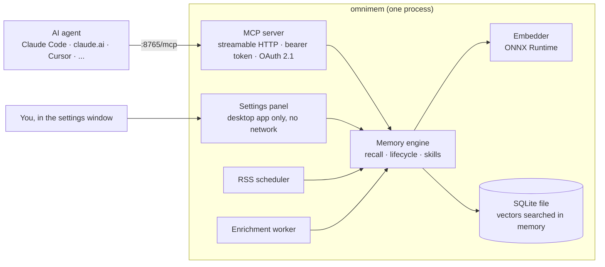

# \<OmniMem\><br><sub><sub>[omnimem.org](https://omnimem.org)</sub></sub>

<sub>Development happens on [Squarecows](https://code.squarecows.com/ric/omnimem). Issues and PRs there please.</sub>

**Stop living the same session twice.**

Every coding agent session starts from zero. No memory of your project. No memory of what failed last week. No memory that you spent three hours last Tuesday working out why `onnxruntime` explodes on Alpine before finding something that actually works.

So you explain the project again. The agent suggests the same broken library again. Same alarm, same song. You're Bill Murray and your agent is Punxsutawney.

OmniMem fixes that. It's a self-hosted MCP server that gives your AI agent persistent memory across sessions, projects and machines. It runs on your own hardware and it's free.

```
claude> use onnxruntime for the embeddings

⚠ WARNING: previously abandoned approach

  onnxruntime: SIGILL crash on Alpine musl libc (effort: 4/5)
  → switched to sentence-transformers instead
```

That warning came from memory, not luck. A mistake you've already paid for doesn't get to charge you twice.

> [!IMPORTANT]
> This is the **7.0 branch**: OmniMem rebuilt as one Rust binary. It isn't released yet. If you want something you can install today, 6.x lives on the `v6.7.x` branch and runs as a Docker Compose stack.

---

## One binary now

OmniMem 6 was four containers: Valkey with vector search, a Python MCP server, a Python web UI and a Python RSS worker. OmniMem 7 is a single program that does all of it.

- **On your desktop** it sits in the tray (or the menu bar on a Mac) with a settings window for everything the old web UI did.
- **On a server** it's `omnimem serve`, a systemd service or a Docker container, configured with environment variables.

Your memories live in one SQLite file. The embedding model runs locally with ONNX Runtime. Nothing leaves your machine unless you give it an Anthropic API key for the optional Claude Haiku features.

---

## Install

> [!NOTE]
> Coming with 7.0.0. Until the first release you can build from source (see [Build from source](docs/quick-start.md#build-from-source)).

| Where | What you get |
|---|---|
| Windows | `OmniMem-<version>-x64.msi` or `-arm64.msi`, a tray app |
| macOS | `OmniMem-<version>.dmg`, a universal menu bar app |
| Linux desktop | The `com.squarecows.OmniMem` Flatpak, a tray app |
| Linux server | `.deb`, `.rpm` or a tarball with an `omnimem.service` systemd unit |
| Containers | The `richarvey/omnimem` image, amd64 and arm64 |

Then point your agent at `http://127.0.0.1:8765/mcp`. The [quick start](docs/quick-start.md) walks through the lot, including moving over from 6.x.

---

## What it remembers

Five kinds of memory, all searched together when your agent recalls something:

- **Episodic**: the decisions you made, the bugs you fixed, the patterns you found. The hard-won stuff you shouldn't have to relearn every morning.
- **Project context**: your stack, goals and current state, so the agent arrives briefed instead of cold.
- **Knowledge**: RSS feeds you pick, fetched on a schedule, summarised by Claude Haiku (if you give it a key), embedded and stored. A feed can also feed a compiled skill directly.
- **Preferences**: rules about how you like to work ("always update the README after a feature lands"), picked up from your conversations and surfaced when they apply.
- **Skills**: SKILL.md documents compiled from your experience in a domain, so the agent works your way from the first prompt. Every change goes through your review. See [the skill compiler](docs/skill-compiler.md).

The top result might be a decision from six months ago on another project, yesterday's fix, or an article that landed on Tuesday night. Doesn't matter where it came from, as long as it's useful.

---

## What makes it different

It isn't a key-value store with an MCP wrapper. OmniMem models how memory actually works: things fade, they sometimes contradict each other, and the hard-won stuff earns its place.

- **[The graveyard](docs/features.md#the-graveyard)**: every dead end is logged with what you tried, why it failed and how long it cost you. The agent checks it before suggesting a library or pattern.
- **[Experience scoring](docs/features.md#experience-scoring)**: something that took four attempts and a weird platform workaround to crack is gold. The harder it was, the more readily it comes back.
- **[Memory lifecycle](docs/features.md#memory-is-not-binary)**: `ACTIVE → DEPRIORITISED → ARCHIVED → DELETED`. "Forget about X" usually means stop bringing it up, not wipe it from existence.
- **[Contradiction detection](docs/features.md#contradiction-detection)**: a quick check on every write, and a deeper look with Claude Haiku when you want one.
- **[Semantic deduplication](docs/features.md#semantic-deduplication)**: near-duplicates are flagged when they're written and cleaned up in bulk with `find_duplicates()`.
- **[One-call briefing](docs/features.md#session-briefing)**: `briefing()` hands over project context, experience stats, stale memories, new articles, contradictions and skill suggestions in one go.
- **[The skill compiler](docs/skill-compiler.md)**: turns reinforced lessons and dead ends into loadable skills, behind a propose-and-accept gate.
- **[Auto-maintenance](docs/features.md#automatic-maintenance)**: duplicates archived, contradictions flagged, expired articles tidied, all in the background.
- **[Licence and provenance](docs/memory-types.md#common-fields)**: every memory records whether it can be redistributed and who's speaking (you, the agent, or a source it retrieved), so a later session can tell evidence from inference.
- **[The settings panel](docs/settings-panel.md)**: browse, search and manage everything from the desktop app's window. It's never served over HTTP.

The ranking behind every recall:

```
score = similarity x surface_score x recency x experience_weight
```

Similarity alone isn't enough, so lifecycle state, age and how hard a lesson was to learn all get a say.

---

## Works with any MCP agent

One memory for all of them: [claude.ai](guides/claude-ai.md), [Claude Code](guides/claude-code.md), [Claude Desktop](guides/claude-desktop.md), [Cursor](guides/cursor.md), [GitHub Copilot](guides/github-copilot.md), [GitLab Duo](guides/gitlab-duo.md), [AWS Kiro](guides/kiro.md), [OpenCode](guides/opencode.md), [OpenAI Codex CLI](guides/codex.md) and [Open Design](guides/open-design.md).

---

## Architecture

One process. The MCP server, the RSS scheduler, the enrichment worker and (on the desktop) the settings window all share one memory engine, one embedder and one SQLite file.



Over the network it serves `/mcp`, the OAuth routes and `/healthz`. That's the whole list. More in [docs/architecture.md](docs/architecture.md).

---

## Self-hosted, open source, yours

No SaaS. No vendor lock-in. No context shipped off to someone else's servers.

- **One file** holds your memories. Back it up however you back up files, or use `dump_to_file()` for a portable JSON export.
- **Local embeddings** with all-MiniLM-L6-v2 on ONNX Runtime: no API calls, no PyTorch, and the same vectors 6.x produced.
- **x86_64 and arm64** everywhere, so it's as happy on a Raspberry Pi or a Graviton box as on a laptop.
- **MIT licensed**: fork it, extend it, run it wherever you like.

Put the MCP port behind a reverse proxy and every machine you work from shares the same memory. See [docs/remote-access.md](docs/remote-access.md).

---

## Documentation

| | |
|---|---|
| [Quick start](docs/quick-start.md) | Installing, building from source, moving from 6.x, connecting your agent |
| [Configuration](docs/configuration.md) | Every setting, for the desktop app and headless installs |
| [Features in depth](docs/features.md) | Lifecycle, graveyard, experience scoring, dedup, contradictions, briefing |
| [The skill compiler](docs/skill-compiler.md) | Compiling experience into loadable skills |
| [MCP tool reference](docs/mcp-tools.md) | All 48 tools |
| [RSS and knowledge](docs/rss-knowledge.md) | Passive knowledge ingestion and promotion |
| [Multiple machines](docs/remote-access.md) | Reverse proxies, OAuth 2.1 for claude.ai, troubleshooting |
| [Settings panel](docs/settings-panel.md) | The desktop app's window, page by page |
| [Architecture](docs/architecture.md) | The process, the recall pipeline, design decisions |
| [Memory type specs](docs/memory-types.md) | The storage model, field by field |
| [Connection guides](guides/) | Per-agent setup |
| Deployment guides | [Docker](guides/docker.md) · [macOS](guides/omnimem-setup-macos.md) · [Raspberry Pi](guides/omnimem-setup-raspberry-pi.md) · [AWS](guides/omnimem-setup-aws-linux.md) · [GCP](guides/omnimem-setup-gcp-linux.md) · [Linux + Tailscale Funnel](guides/omnimem-setup-linux-tailscale.md) |

Per-namespace specs, if you want to know exactly what gets stored and by whom: [overview](docs/memory-types.md) · [episodic](docs/memory-episodic.md) · [project](docs/memory-project.md) · [knowledge](docs/memory-knowledge.md) · [preference](docs/memory-preference.md) · [skill](docs/memory-skill.md)

---

## Contributing

Issues and PRs are welcome on [Squarecows](https://code.squarecows.com/ric/omnimem). It's a Cargo workspace (Rust 1.94 or newer): `cargo test` runs the suite with no GTK needed, and `scripts/desktop-check.sh` builds and smoke-tests the desktop app in a container. New MCP tools, extra scoring multipliers and other embedding models are all fair game.

---

## Licence

MIT. Free to use, fork and modify. No enterprise tier, no hosted version, no strings.

---

*Built by Ric Harvey @ [SquareCows Ltd](https://squarecows.com), an AI and automation consultancy for people who'd rather own their tools.*
