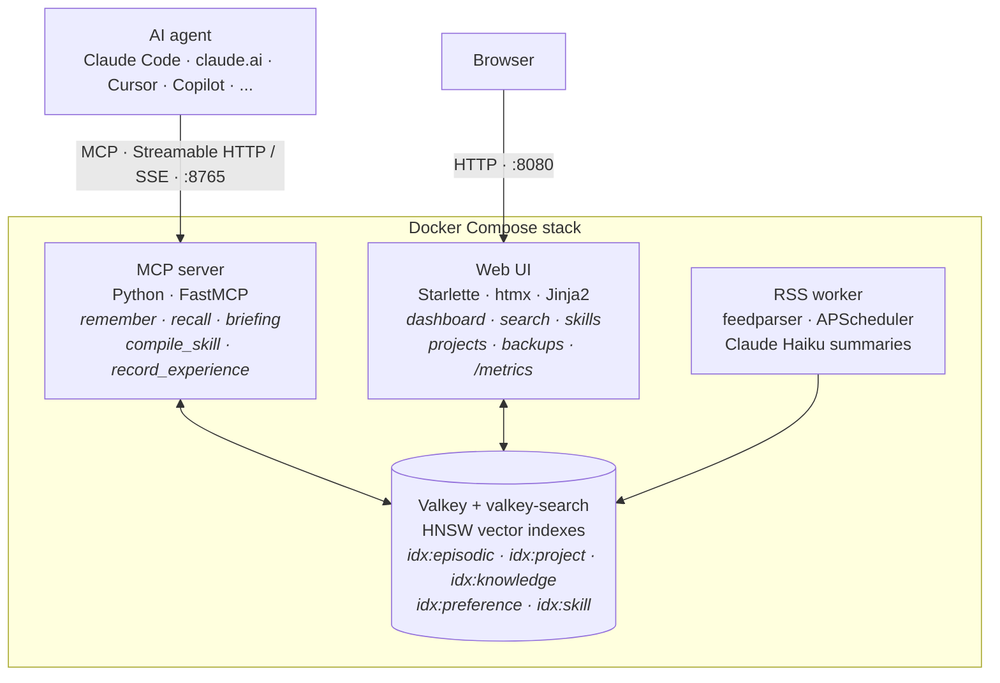

# \<OmniMem\><br><sub><sub>[omnimem.org](https://omnimem.org)</sub></sub>

[](https://code.squarecows.com/ric/omnimem/actions)
[](https://code.squarecows.com/ric/omnimem/actions)
[](https://code.squarecows.com/ric/omnimem/actions)

<sub>Development happens on [Squarecows](https://code.squarecows.com/ric/omnimem) — issues and PRs there please.</sub>

**Stop living the same session twice.**

Every Claude Code session starts from zero. No memory of your project. No memory of what failed last week. No memory that you spent three hours last Tuesday discovering why `onnxruntime` explodes on Alpine before finding something that actually works.

So you explain the project again. Claude suggests the same broken library again. Same alarm. Same song. You are Bill Murray and Claude is Punxsutawney.

OmniMem fixes that. It is a self-hosted MCP server that gives your AI agent persistent memory across sessions, projects, and machines. It runs on your own hardware and it is free forever.

```
claude> use onnxruntime for the embeddings

⚠ WARNING: previously abandoned approach

  onnxruntime — SIGILL crash on Alpine musl libc (effort: 4/5)
  → switched to sentence-transformers instead
```

That warning came from memory, not luck. The mistake you already paid for does not get to charge you twice.

---

## Get going quickly

> [!TIP]
> One command gets the full stack running from the pre-built Docker Hub images:
>
> ```bash
> curl -fsSL https://code.squarecows.com/ric/omnimem/raw/branch/main/install.sh | bash
> ```
>
> Then point your agent at it — the [quick start](docs/quick-start.md) walks through the rest, or jump to the fuller [quick start section](#quick-start) below.

---

## What it remembers

Five kinds of memory, all searched together at recall time:

- **Episodic** — the decisions you made, the bugs you fixed, the patterns you discovered. The things that took real effort to learn and should not have to be re-learned every morning.
- **Project context** — your stack, goals, and current state. The agent arrives at every session already briefed rather than starting cold.
- **Knowledge** — RSS feeds you configure, fetched on a schedule, summarised by Claude Haiku, embedded, and stored. When a relevant article landed last week, it surfaces as a starting point worth reading.
- **Preferences** — prescriptive rules about how you want to work ("always update the README after a feature lands"), extracted from your conversations automatically and surfaced whenever they apply.
- **Skills** — SKILL.md documents compiled from your accumulated experience in a domain, so the agent works your way from the first prompt. Derived from the other namespaces, never hand-edited, and every change goes through your review. See [the skill compiler](docs/skill-compiler.md).

The top recall result might be a decision from six months ago on a different project, a solution from yesterday, or an article that landed on Tuesday night. It does not matter where it came from as long as it is useful.

---

## What makes it different

Not just a key-value store with an MCP wrapper. OmniMem models how memory actually works: things fade over time, they sometimes contradict each other, and the hard-won stuff earns its place.

- **[The Graveyard](docs/features.md#the-graveyard)** — every dead end gets logged with what you tried, why it failed, and how much time you burned. The agent checks it before suggesting a library or pattern.
- **[Experience scoring](docs/features.md#experience-scoring)** — something that took four attempts and a weird platform workaround to crack is gold. The harder it was, the more readily it surfaces next time.
- **[Memory lifecycle](docs/features.md#memory-is-not-binary)** — `ACTIVE → DEPRIORITISED → ARCHIVED → DELETED`. "Forget about X" usually means stop bringing it up, not wipe it from existence. Deprioritised memories can earn their way back.
- **[Contradiction detection](docs/features.md#contradiction-detection)** — if a new memory disagrees with something stored, OmniMem catches it. Fast heuristic on every write, optional deeper analysis via Claude Haiku.
- **[Semantic deduplication](docs/features.md#semantic-deduplication)** — near-identical memories get flagged at write time and cleaned up in bulk with `find_duplicates()`.
- **[One-call briefing](docs/features.md#session-briefing)** — a single `briefing()` returns project context, experience stats, stale memories, new articles, contradiction warnings, and skill suggestions. No three-step warm-up.
- **[The skill compiler](docs/skill-compiler.md)** — distils reinforced lessons and dead ends into loadable skills, behind a propose-and-accept gate so bad lessons cannot become policy silently.
- **[Auto-maintenance](docs/features.md#automatic-maintenance)** — duplicates archived, contradictions flagged, expired knowledge cleaned up, all in the background.
- **[Web UI](docs/web-ui.md)** — browse, search, and manage everything from an htmx dashboard, with telemetry and a Prometheus `/metrics` endpoint.

The ranking formula behind every recall:

```
score = similarity x surface_score x recency x experience_weight
```

Four factors decide what comes back. Semantic similarity alone is not enough — lifecycle state, age, and how hard the lesson was to learn all play a role.

---

## Works with any MCP agent

One memory layer for all of them: [claude.ai](guides/claude-ai.md), [Claude Code](guides/claude-code.md), [Claude Desktop](guides/claude-desktop.md), [Cursor](guides/cursor.md), [GitHub Copilot](guides/github-copilot.md), [GitLab Duo](guides/gitlab-duo.md), [AWS Kiro](guides/kiro.md), [OpenCode](guides/opencode.md), [OpenAI Codex CLI](guides/codex.md), and [Open Design](guides/open-design.md).

---

## Architecture

Four containers. Nothing leaves your machine. Local embeddings via sentence-transformers, storage in Valkey with vector search, and both front doors share the same memory engine.



The full picture — the recall pipeline, storage model, and design decisions — is in [docs/architecture.md](docs/architecture.md).

---

## Self-hosted, open source, yours

No SaaS. No vendor lock-in. No context shipped to someone else's servers.

- **Valkey** is an open source Redis fork. All your data stays in a named Docker volume on your own machine.
- **Multi-arch Docker images** for amd64 and arm64. It runs on a Raspberry Pi, AWS Graviton, or Apple Silicon just as well as x86.
- **sentence-transformers** runs embeddings locally with no API calls.
- **MIT licensed** means fork it, extend it, run it wherever you want.
- **One backup command** calls `dump_to_file()` and exports everything to a JSON file you own.

Expose the MCP port through your reverse proxy and every machine you work from shares the same memory. One deployment, everywhere — see [docs/remote-access.md](docs/remote-access.md).

---

## Quick start

The installer checks Docker is installed, generates secure passwords, writes a sensible `.env`, and starts everything from the pre-built Docker Hub images:

```bash
curl -fsSL https://code.squarecows.com/ric/omnimem/raw/branch/main/install.sh | bash
```

Or build from source:

```bash
git clone https://code.squarecows.com/ric/omnimem.git && cd omnimem
cp .env.example .env
# Set VALKEY_PASSWORD and ANTHROPIC_API_KEY in .env
docker compose up -d
```

Then point your agent at it — **Claude Code** (`~/.claude.json`):

```json
{
  "mcpServers": {
    "omnimem": {
      "type": "sse",
      "url": "http://localhost:8765/sse"
    }
  }
}
```

The server delivers its usage guide to any connecting agent automatically via the MCP `instructions` field — no configuration file needed. The web dashboard is at `http://localhost:8080`.

The full walkthrough, including auth tokens, permission settings, and the other agents, is in [docs/quick-start.md](docs/quick-start.md).

---

## Documentation

| | |
|---|---|
| [Quick start](docs/quick-start.md) | Installer, building from source, connecting your agent |
| [Features in depth](docs/features.md) | Lifecycle, graveyard, experience scoring, dedup, contradictions, briefing |
| [The skill compiler](docs/skill-compiler.md) | Compiling experience into loadable skills |
| [MCP tool reference](docs/mcp-tools.md) | All 30+ tools |
| [Configuration reference](docs/configuration.md) | Every environment variable |
| [RSS & knowledge](docs/rss-knowledge.md) | Passive knowledge ingestion and promotion |
| [Multiple machines](docs/remote-access.md) | Reverse proxy, OAuth 2.1 for claude.ai, troubleshooting |
| [Web UI](docs/web-ui.md) | The management dashboard and Prometheus metrics |
| [Architecture](docs/architecture.md) | Containers, recall pipeline, design decisions |
| [Memory type specs](docs/memory-types.md) | The storage model, field by field |
| [Connection guides](guides/) | Per-agent setup |
| Deployment guides | [macOS](guides/omnimem-setup-macos.md) · [Raspberry Pi](guides/omnimem-setup-raspberry-pi.md) · [AWS](guides/omnimem-setup-aws-linux.md) · [GCP](guides/omnimem-setup-gcp-linux.md) · [Linux + Tailscale Funnel](guides/omnimem-setup-linux-tailscale.md) |

Per-namespace storage specifications, if you want to know exactly what gets written to Valkey and by whom: [overview](docs/memory-types.md) · [episodic](docs/memory-episodic.md) · [project](docs/memory-project.md) · [knowledge](docs/memory-knowledge.md) · [preference](docs/memory-preference.md) · [skill](docs/memory-skill.md)

---

## Contributing

Issues and PRs are welcome. Development happens on [Squarecows](https://code.squarecows.com/ric/omnimem) — issues and PRs there please. OmniMem is designed to be extended and the scoring pipeline is structured so new multipliers can be added without touching the core. New MCP tools, additional namespace types, and alternative embedding backends are all reasonable directions.

---

## Licence

MIT. Free to use, fork, and modify. No enterprise tier, no hosted version, no strings.

---

*Built by Ric Harvey @ [SquareCows Ltd](https://squarecows.com), an AI and automation consultancy for people who would rather own their tools.*
