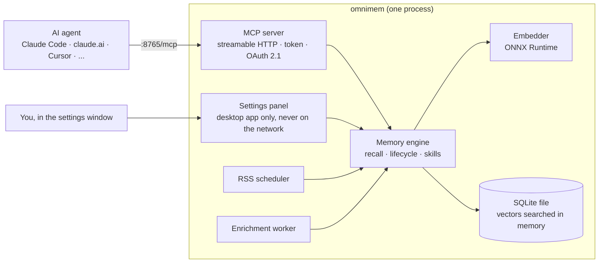

# \<OmniMem\><br><sub><sub>[omnimem.org](https://omnimem.org)</sub></sub>

<sub>Development happens on [Squarecows](https://code.squarecows.com/ric/omnimem). Issues and PRs there please.</sub>

**Stop living the same session twice.**

Every coding agent session starts from zero. It doesn't know your project. It doesn't remember what failed last week. It has no idea you lost an evening working out why WebKitGTK quietly ignores a redirect from a custom URL scheme.

So you explain everything again, and the agent confidently suggests the exact thing that didn't work. Same alarm, same song. You're Bill Murray and your agent is Punxsutawney.

OmniMem fixes that. It gives your AI agent a memory that lasts across sessions, projects and machines, over MCP, so it works with whichever agent you like. It runs on your own kit and it's free.

```
claude> answer the settings form with a 303 redirect

⚠ WARNING: previously abandoned approach

  303 from omnimem://: WebKitGTK never follows it (effort: 4/5)
  → answer with a page that replaces itself instead
```

That warning came from memory, not luck. A mistake you've already paid for doesn't get to charge you twice.

> [!IMPORTANT]
> OmniMem 7 isn't released yet. You can [build it from source](docs/quick-start.md#build-from-source) today; the installers below arrive with 7.0.0.

---

## One program, two ways to run it

OmniMem 7 is a single binary. The MCP server, the memory engine, the embedding model, RSS ingestion and the database all live in one process, with your memories in one SQLite file. No containers to wrangle, no database server to babysit.

- **On your desktop** it sits in the tray (or the menu bar on a Mac). The icon tells you it's running, copies the MCP address for you, and opens a settings window where you can browse memories, review skills, edit your feeds, take backups and change settings.
- **On a server** it's `omnimem serve`: a systemd service or a container, configured with environment variables, with nothing graphical anywhere near it.

The embedding model (all-MiniLM-L6-v2 on ONNX Runtime) runs locally. Nothing leaves the machine unless you add an Anthropic API key for the optional Claude Haiku features: fact extraction, query expansion, deeper contradiction checks and RSS summaries.

---

## Install

> [!NOTE]
> Coming with 7.0.0. Until the first release you can build from source (see [Build from source](docs/quick-start.md#build-from-source)).

| Where | What you get |
|---|---|
| Windows | `OmniMem-<version>-x64.msi` or `-arm64.msi`, a tray app |
| macOS | `OmniMem-<version>.dmg`, a universal menu bar app |
| Linux desktop | The `com.squarecows.OmniMem` Flatpak, a tray app |
| Linux server | `.deb`, `.rpm` or a tarball, with an `omnimem.service` systemd unit |
| Containers | The `richarvey/omnimem` image, amd64 and arm64 |

Then point your agent at `http://127.0.0.1:8765/mcp` (the tray's **Copy MCP URL** puts it on your clipboard). For Claude Code that's:

```json
{
  "mcpServers": {
    "omnimem": {
      "type": "http",
      "url": "http://127.0.0.1:8765/mcp"
    }
  }
}
```

The server hands its own usage guide to every agent that connects, so there's no instructions file to copy around. The [quick start](docs/quick-start.md) covers the rest.

---

## What it remembers

Five kinds of memory, all searched together when your agent recalls something:

- **Episodic**: the decisions you made, the bugs you fixed, the patterns you found. The hard-won stuff you shouldn't have to relearn every morning.
- **Project context**: your stack, goals and current state, so the agent turns up briefed instead of cold.
- **Knowledge**: articles from RSS feeds you pick, fetched on a schedule, embedded and stored (and summarised by Claude Haiku if you've given it a key). A feed can also feed a compiled skill directly.
- **Preferences**: rules about how you like to work ("always update the README after a feature lands"), picked up from your conversations and surfaced when they apply.
- **Skills**: SKILL.md documents compiled from your experience in a domain, so the agent works your way from the first prompt. Nothing changes without your say-so. See [the skill compiler](docs/skill-compiler.md).

The top result might be a decision from six months ago on another project, yesterday's fix, or an article that landed on Tuesday night. It doesn't matter where it came from, as long as it's useful.

---

## What makes it different

It isn't a key-value store with an MCP wrapper. OmniMem tries to behave the way memory actually does: things fade, they sometimes contradict each other, and the hard-won stuff earns its place.

- **[The graveyard](docs/features.md#the-graveyard)**: every dead end is logged with what you tried, why it failed and how long it cost you. The agent checks it before suggesting a library or pattern.
- **[Experience scoring](docs/features.md#experience-scoring)**: something that took four attempts and a weird workaround to crack is gold. The harder it was, the more readily it comes back.
- **[Memory lifecycle](docs/features.md#memory-is-not-binary)**: `ACTIVE → DEPRIORITISED → ARCHIVED → DELETED`. "Forget about X" usually means stop bringing it up, not wipe it from existence.
- **[Contradiction detection](docs/features.md#contradiction-detection)**: a quick check on every write, and a deeper look with Claude Haiku when you want one.
- **[Semantic deduplication](docs/features.md#semantic-deduplication)**: near-duplicates get flagged as they're written and cleaned up in bulk with `find_duplicates()`.
- **[One-call briefing](docs/features.md#session-briefing)**: `briefing()` hands over project context, experience stats, stale memories, new articles, contradictions and skill suggestions in one go.
- **[The skill compiler](docs/skill-compiler.md)**: turns reinforced lessons and dead ends into loadable skills, behind a propose-and-accept gate so a one-off opinion can't quietly become policy.
- **[Auto-maintenance](docs/features.md#automatic-maintenance)**: duplicates archived, contradictions flagged, expired articles tidied, all in the background.
- **[Licence and provenance](docs/memory-types.md#common-fields)**: every memory records whether it can be redistributed and who's speaking (you, the agent, or a source it retrieved), so a later session can tell evidence from inference.

The ranking behind every recall:

```
score = similarity x surface_score x recency x experience_weight
```

Similarity on its own isn't enough, so lifecycle state, age and how hard a lesson was to learn all get a say.

---

## Works with any MCP agent

One memory for all of them: [claude.ai](guides/claude-ai.md), [Claude Code](guides/claude-code.md), [Claude Desktop](guides/claude-desktop.md), [Cursor](guides/cursor.md), [GitHub Copilot](guides/github-copilot.md), [GitLab Duo](guides/gitlab-duo.md), [AWS Kiro](guides/kiro.md), [OpenCode](guides/opencode.md), [OpenAI Codex CLI](guides/codex.md) and [Open Design](guides/open-design.md). 48 tools, served over streamable HTTP.

Run it on one machine and put it behind a reverse proxy, and every laptop and agent you use shares the same memory. A shared token covers your own clients; OAuth 2.1 with a login page covers claude.ai and anything else that signs in. See [multiple machines](docs/remote-access.md).

---

## How it fits together



Over the network it answers `/mcp`, the OAuth routes and `/healthz`, and that's the whole list. The settings window talks to the process directly, so there's no dashboard port for anyone else to find. More in [the architecture doc](docs/architecture.md).

---

## Self-hosted, open source, yours

No SaaS. No vendor lock-in. No context shipped off to someone else's servers.

- **One file** holds your memories. Back it up the way you back up any file, or use `dump_to_file()` for a portable JSON export.
- **Local embeddings**: no API calls to turn text into vectors, and no GPU needed.
- **x86_64 and arm64** everywhere, so it's as happy on a Raspberry Pi or a Graviton box as on your laptop.
- **MIT licensed**: fork it, extend it, run it wherever you like.

---

## Coming from 6.x?

OmniMem 6 was a Docker Compose stack: Valkey, a Python MCP server, a web UI and an RSS worker. Version 7 does the same job as one program, and your memories come with you:

1. Take a backup on 6.x with `dump_to_file()`.
2. Import it with `omnimem import <file>`, or restore it from the settings window's Backups page. Every memory gets re-embedded (roughly 8 ms each).

The tools, the vectors, the recall scoring and your compiled skills behave exactly as they did, so nothing needs retuning. Your agents just need their URL changing from `/sse` to `/mcp`. The [quick start](docs/quick-start.md) has the details, and 6.x itself carries on in the `v6.7.x` branch.

---

## Documentation

| | |
|---|---|
| [Quick start](docs/quick-start.md) | Installing, building from source, moving from 6.x, connecting your agent |
| [Configuration](docs/configuration.md) | Every setting, for the desktop app and headless installs |
| [Features in depth](docs/features.md) | Lifecycle, graveyard, experience scoring, dedup, contradictions, briefing |
| [The skill compiler](docs/skill-compiler.md) | Compiling experience into loadable skills |
| [MCP tool reference](docs/mcp-tools.md) | All 48 tools |
| [RSS and knowledge](docs/rss-knowledge.md) | Passive knowledge ingestion and promotion |
| [Multiple machines](docs/remote-access.md) | Reverse proxies, OAuth 2.1 for claude.ai, troubleshooting |
| [Settings panel](docs/settings-panel.md) | The desktop app's window, page by page |
| [Architecture](docs/architecture.md) | The process, the recall pipeline, design decisions |
| [Memory type specs](docs/memory-types.md) | The storage model, field by field |
| [Connection guides](guides/) | Per-agent setup |
| Deployment guides | [Docker](guides/docker.md) · [macOS](guides/omnimem-setup-macos.md) · [Raspberry Pi](guides/omnimem-setup-raspberry-pi.md) · [AWS](guides/omnimem-setup-aws-linux.md) · [GCP](guides/omnimem-setup-gcp-linux.md) · [Linux + Tailscale Funnel](guides/omnimem-setup-linux-tailscale.md) |

Per-namespace specs, if you want to know exactly what gets stored and by whom: [overview](docs/memory-types.md) · [episodic](docs/memory-episodic.md) · [project](docs/memory-project.md) · [knowledge](docs/memory-knowledge.md) · [preference](docs/memory-preference.md) · [skill](docs/memory-skill.md)

---

## Contributing

Issues and PRs are welcome on [Squarecows](https://code.squarecows.com/ric/omnimem). It's a Cargo workspace (Rust 1.94 or newer): `cargo test` runs the suite without needing GTK, and `scripts/desktop-check.sh` builds and smoke-tests the desktop app in a container. New MCP tools, extra scoring multipliers and other embedding models are all fair game.

---

## Licence

MIT. Free to use, fork and modify. No enterprise tier, no hosted version, no strings.

---

*Built by Ric Harvey @ [SquareCows Ltd](https://squarecows.com), an AI and automation consultancy for people who'd rather own their tools.*
