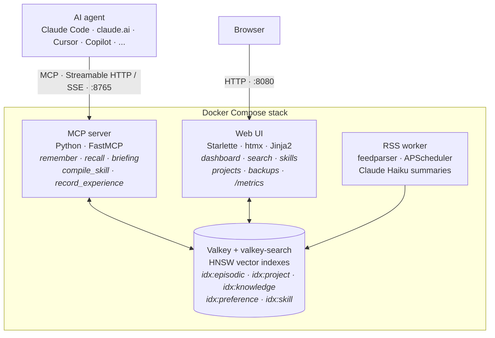
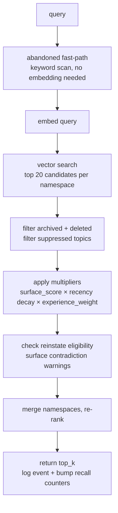

# Architecture

Four containers, nothing leaves your machine. Both the MCP server and web UI connect directly to Valkey and share the `mcp_server/memory/` package, so there is one engine and two front doors.



| Service | Port | Purpose |
|---------|------|---------|
| `valkey` | 6379 (internal) | Vector DB + search, persisted to a named volume with AOF |
| `mcp_server` | 8765 | MCP transport (Streamable HTTP or SSE) |
| `rss_worker` | — | Background feed ingestion |
| `web_ui` | 8080 | Web dashboard + `/metrics` Prometheus endpoint |

Embeddings are computed locally — all-MiniLM-L6-v2, 384 dimensions, run through ONNX Runtime with the Rust tokenizers library since 6.7 (the same vectors sentence-transformers produced, without PyTorch) — no API calls for storage or recall. The Anthropic API is only used for the optional extras: RSS summaries, fact extraction, query expansion, and Tier 2 contradiction checks.

## The recall pipeline

Every `recall()` runs the same pipeline:



The final ranking formula:

```
score = similarity x surface_score x recency x experience_weight
```

Four factors decide what comes back. Semantic similarity alone isn't enough — lifecycle state, age, and how hard the lesson was to learn all play a role. [Features in depth](features.md) explains each multiplier.

## Storage model

Every memory is a Valkey hash under a namespaced key (`mem:episodic:{ULID}`, `mem:project:{name}`, `mem:knowledge:{hash}`, `mem:preference:{ULID}`, `mem:skill:gen:{domain}-{user}`). The [memory type specifications](memory-types.md) document every field of every namespace.

Key design decisions:

- **ULIDs** for memory keys — sortable, collision-free
- **Valkey** over Redis — open source fork, with valkey-search providing HNSW vector indexes
- **ONNX Runtime for embeddings** (6.7) — the model's maintainer-exported ONNX graph, mean pooling and normalisation in numpy. Cosine 1.0 against the sentence-transformers output, roughly a third of the single-text latency, a tenth of the load time, a third of the resident memory, and no PyTorch in the image. `EMBEDDING_BACKEND=torch` brings the old path back as a rollback
- **Shared `memory/` package** between the MCP server and web UI — no code duplication
- **Debian-slim Docker base** — chosen when PyTorch (no musllinux wheels) ruled Alpine out; PyTorch is gone since 6.7 but the base stays, because onnxruntime and tokenizers ship manylinux wheels too and nothing is gained by fighting musl
- **Multi-arch images** for amd64 and arm64
