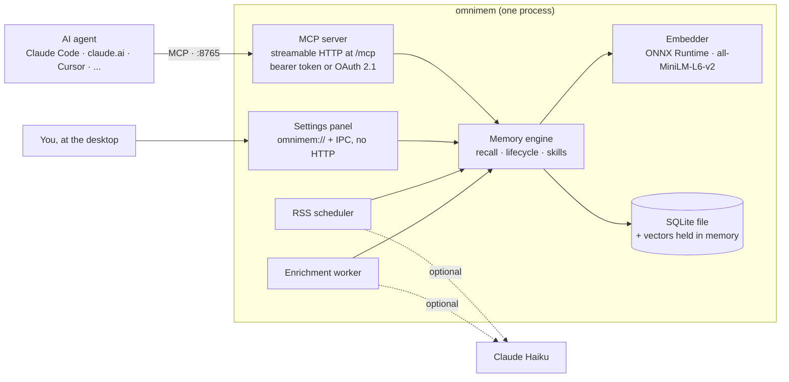
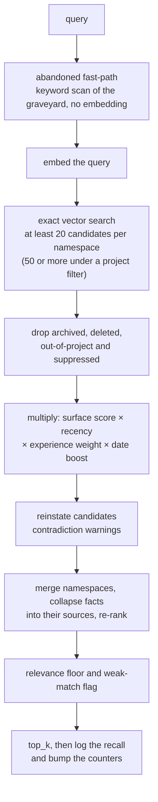

# Architecture

OmniMem 7 is one binary. In 6.x it was four containers (Valkey, the Python MCP server, a web UI and an RSS worker) and a Compose file holding them together. Now it's a single process that keeps its own database, serves MCP, runs the RSS scheduler and, on a desktop, draws its own tray icon and settings window.

Nothing leaves your machine unless you ask it to. Embeddings are computed locally, and the Anthropic API is only called for the optional extras.



Over the network the binary answers three things and nothing else: `/mcp`, the OAuth routes (discovery, register, authorize, token, revoke and the login page) when OAuth is on, and `/healthz`. There's no web UI and no `/metrics` any more. Everything the old dashboard showed lives in the desktop app's [settings panel](settings-panel.md), which is handed to its window through a custom protocol and never touches a socket.

One embedder serves every caller. In 6.x each Python service loaded its own copy of the model, which is a daft way to spend 900 MB.

## How it runs

`omnimem serve` runs headless: the engine, the enrichment worker, the RSS scheduler and the MCP server, configured by environment variables. That's what the Linux packages and the Docker image run.

`omnimem` with no command (on a build with the `desktop` feature) runs the desktop app: the same services on background threads, with the platform event loop on the main thread driving a tray or menu bar icon and the settings window. See [the settings panel](settings-panel.md).

The other commands are for moving data and poking at a store: `import` (a 6.x backup), `export`, `stats`, `search`, `embed` and `rss` (one ingestion cycle by hand, or `--dry-run` to see what it would fetch).

## Crates

| Crate | Holds |
|---|---|
| `omnimem-core` | Namespaces, keys, record types, validation, the licence and provenance vocabularies, the content hash, the settings overlay every crate reads through |
| `omnimem-embed` | The ONNX engine and model resolution (local folder, Hugging Face cache, download pinned to a revision) |
| `omnimem-store` | SQLite schema and migrations, the in-memory vector matrix, filtered exact k-NN, backup import and export, the OAuth tables |
| `omnimem-engine` | The recall pipeline, dedup, contradictions, lifecycle, experience, projects and domains, lineage, chunking, dates, the skill compiler, scan and transfer, maintenance, enrichment |
| `omnimem-llm` | The Anthropic Messages client, with retries |
| `omnimem-mcp` | The 48 tools and their descriptions, the instructions, bearer and OAuth 2.1 auth, the Host and Origin guard |
| `omnimem-rss` | Feed fetching and parsing, summary and digest modes, the licence gate, the scheduler |
| `omnimem-settings` | The settings panel's pages, rendered in-process. No HTTP routes |
| `omnimem-app` | What the server and the desktop app share: opening the engine, running the services, the data folder, the single-instance lock |
| `omnimem-desktop` | The tray or menu bar icon, the settings window, start at login |
| `omnimem` | The binary and its subcommands |

The GUI crate sits outside the workspace's default members, so a plain `cargo build` needs no GTK or WebKitGTK.

## Storage

One SQLite file in WAL mode. By default that's `data/omnimem.db` for `omnimem serve`, or `omnimem.db` in the desktop app's data folder; `OMNIMEM_DB` (or `--db`) points it anywhere. `feeds.yml` and the `backups/` folder live beside it.

| Table | What's in it |
|---|---|
| `memories` | One row per memory. The record is a JSON object of fields, and the columns anything filters or sorts on (namespace, state, project, feed, timestamps, content hash) are generated from it and indexed. A 6.x field with no column survives an import untouched |
| `vectors` | 384 little-endian float32s per memory, the same encoding Valkey held |
| `kv` | Everything that was a non-memory Valkey key: `meta:*` hashes, recall logs, suppressed topics, caches. Expiry is enforced on read |
| `enrich_queue` | Fact extraction jobs. Durable, so a crash no longer loses one |
| `oauth_clients`, `oauth_codes`, `oauth_tokens` | OAuth state. Codes and tokens are stored as SHA-256 hashes, so a copy of the database holds nothing a client could present |

Keys are unchanged from 6.x (`mem:episodic:{ULID}`, `mem:project:{name}`, `mem:knowledge:{id}`, `mem:preference:{ULID}`, `mem:skill:gen:{domain}-{user}`), and the [memory type specifications](memory-types.md) document every field.

### Vector search

On start, every vector is loaded into one contiguous matrix per namespace and kept in step with writes. A query takes dot products against the rows that pass the filter (the vectors are unit length, so that's cosine similarity) and keeps the top k.

It's exact, not approximate. At OmniMem's scale (tens of thousands of memories) a full scan of a 384-dimension matrix takes a few milliseconds and gives the same answer every time, which the skill compiler and the v7 clustering rules depend on. Filters are plain SQL, so the valkey-search tag-query quirks and index drift went out with Valkey.

### Embeddings

all-MiniLM-L6-v2, 384 dimensions, run through ONNX Runtime with the same Rust tokeniser the 6.7 Python engine used. The vectors match the 6.x reference vectors to within 1e-4, so an imported store recalls the same way it did before. The model downloads into the shared Hugging Face cache on first start; `HF_HUB_OFFLINE` keeps it off the network once it's there.

## The recall pipeline

Every `recall()` runs the same steps:



The ranking formula:

```
score = similarity x surface_score x recency x experience_weight x date_boost
```

- **Surface score** comes from the lifecycle state: active 1.0, deprioritised 0.2 (`DEPRIORITISED_WEIGHT`), archived 0.
- **Recency** stays at 1.0 until a memory is `RECENCY_DECAY_DAYS` old (90), then loses 5% per 30 days, bottoming out at 0.3.
- **Experience weight** rewards hard-won lessons, up to 1.8x for effort 5. [Features in depth](features.md#experience-scoring) has the table.
- **Date boost** (up to 1.5x) applies when the query mentions a date and the memory has an `event_date` close to it.

A deprioritised memory whose reinstate hints match the query comes back as a reinstate candidate with a fixed score of 0.6. Results whose raw similarity falls below `RECALL_MIN_SCORE` (0.15) are dropped, and ones under `RECALL_WEAK_SCORE` (0.35) are flagged `weak_match`, so `top_k` is a ceiling rather than a quota. When an extracted fact and its verbatim source both make the cut, the source wins.

## Design decisions that still hold

- **ULIDs** for memory keys: sortable and collision-free
- **Licence and provenance are reported, never scored on.** Landing a field and changing ranking with it are separate decisions
- **Skills are compiled deterministically.** The same source memories render a byte-identical body, so recompiles don't propose noise diffs. A golden fixture written by the 6.7.1 Python holds the Rust renderer to that
- **Skill writes are gated** behind propose and accept. Experience and graveyard writes aren't. That asymmetry is the whole point
- **Domains route, they never label memories.** A project declares its kinds of work; the memories inside don't inherit them
- **Fail closed.** A non-loopback `MCP_HOST` with no token and no OAuth refuses to start, and so does OAuth that's switched on but incomplete
- **The settings panel is never served over HTTP.** Nothing else on the machine or the network can reach it

## Compared with 6.x

What stays the same: the 48 tool names, parameters and descriptions, the JSON they return, the vectors, the recall scoring, skill bodies, the backup file format, skill bundles, `feeds.yml`, and every environment variable apart from the Valkey and web UI ones.

What's gone: Valkey, the Compose stack, the web UI and `/metrics` over HTTP, the SSE transport (streamable HTTP only) and the PyTorch backend.

To move across, run `dump_to_file` on 6.x and import the file with `omnimem import <file>` or the desktop app's Backups page. The full port plan, with the evidence for each phase, is in [rust-port-plan.md](rust-port-plan.md).
