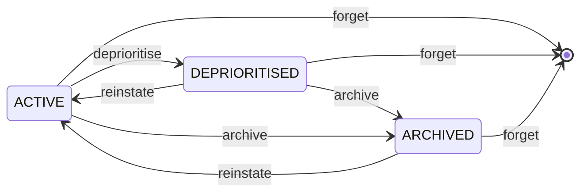

# Features in Depth

The bits that make OmniMem more than a key-value store with an MCP wrapper: a proper lifecycle, a graveyard of dead ends, experience scoring, deduplication, contradiction detection, a one-call briefing, cross-project recall and background maintenance. The [skill compiler](skill-compiler.md) gets a page of its own.

## Memory is not binary

Most systems either remember something or delete it. OmniMem has a lifecycle:



| State | Recall weight |
|---|---|
| `ACTIVE` | 1.0x |
| `DEPRIORITISED` | 0.2x (`DEPRIORITISED_WEIGHT`) |
| `ARCHIVED` | 0x |
| `DELETED` | gone |

When you say "forget about X" you rarely mean destroy it. You mean stop bringing it up. So OmniMem deprioritises rather than deletes, and if something becomes relevant again later it can earn its way back.

- **`deprioritise`** when something should stop surfacing but might matter again one day. Add `reinstate_hints` to say what should bring it back: when a later query contains one, the memory resurfaces as a reinstate candidate with a note explaining why it was pushed down.
- **`archive`** for things that are definitely out of date but worth keeping for history.
- **`forget`** only when you want it gone for good. It needs `confirm=True`, so nothing vanishes by accident.

Deprioritise a memory with an effort score of 4 or more and OmniMem will point that out first. It isn't blocking you, just checking you meant to bury something that was properly hard to figure out.

You can also suppress whole topics. `suppress_topic("pisource.org")` keeps anything mentioning it out of every recall, in every session, until you lift it. And `deprioritise_project` turns an entire project down in one go (reversibly, with `reinstate_project`).

The full storage model is in the [memory type specifications](memory-types.md).

## The graveyard

OmniMem tracks what didn't work as well as what did, and why.

Every abandoned approach is logged with its name, type and the reason it failed. Before your agent suggests a library or a pattern, the graveyard gets checked, and if you've tried it before and given up, the warning comes first, ahead of anything else in recall.

```
WARNING: previously abandoned approaches match this query

  onnxruntime       library     SIGILL crash on Alpine musl libc       effort: 4/5
  FLAT index        approach    too slow above 10k vectors              effort: 3/5
  openai embeddings service     API cost and latency were prohibitive   effort: 2/5
```

The fast path is a keyword scan of the graveyard, so it doesn't even wait for an embedding. Record dead ends with `record_experience` at the end of some work, or one at a time with `log_abandoned` as you go. Abandon something that took real effort (4 or more) and the approach names are suppressed automatically.

Dead ends don't get a second chance to waste your afternoon.

## Experience scoring

Not every success is equal. Something that worked first time is useful. Something that took four attempts, two abandoned libraries and a weird platform-specific workaround is gold, and it should surface more readily.

OmniMem gives every memory an experience weight from its effort and outcome:

| Effort | Meaning | Weight when it succeeded |
|---|---|---|
| 1 | Worked first time | 1.0x |
| 2 | Minor friction | 1.1x |
| 3 | Multiple iterations | 1.25x |
| 4 | Significant struggle | 1.5x |
| 5 | Battle-hardened | 1.8x |

A pivot starts from 0.7 and gets the same multiplier, so a hard-won pivot still counts. An abandoned outcome is a flat 0.1 however much effort went in: effort multiplies success, it never amplifies a failure.

That weight goes straight into the ranking:

```
score = similarity x surface_score x recency x experience_weight x date_boost
```

A battle-hardened success is worth nearly twice as much as something trivial. Knowledge earns its rank. [Architecture](architecture.md#the-recall-pipeline) walks through the rest of the formula.

## Semantic deduplication

Memory systems pile up near-identical entries over time. OmniMem catches them in two places.

When you `remember()` something, it's compared with what's already stored, and above `DEDUP_SIMILARITY_THRESHOLD` (0.92) you get the existing memory back instead of a redundant copy. Pass `force=True` when you really do want both.

For a bulk tidy-up, `find_duplicates()` scans a namespace using the vectors already stored (no re-embedding) and returns clusters of near-duplicates. Point it at your episodic memories now and again and archive the extras, or use the Duplicates page in the [settings panel](settings-panel.md).

## Contradiction detection

The graveyard warns you about things that failed. Contradiction detection warns you about things that disagree with each other.

When `remember()` stores a memory it runs a quick heuristic: find similar memories and look for opposing language (one says "use X", the other says "avoid X"). If it finds a likely contradiction, it stores the memory anyway and hands back a warning so you can look into it.

For a closer look, `check_contradictions(use_api=True)` asks Claude to judge the candidate pairs. Confirmed contradictions are linked on both memories and flagged whenever either one comes up in recall. Without an API key you get the heuristic and nothing breaks.

```
contradiction_warning:
  existing_key: mem:episodic:01ARZ3NDEK...
  existing_content: "Always use connection pooling for the database..."
  explanation: "These memories discuss the same topic but contain opposing language"
```

## Session briefing

Rather than three separate calls at the start of a session, one `briefing(project="myproject")` gives your agent everything it needs:

- **Project context:** current state, stack, goals and domains
- **Experience summary:** effort stats, the graveyard, breakthroughs
- **Stale memories:** active memories untouched for `STALE_MEMORY_DAYS` (30)
- **New knowledge:** RSS articles from the last 7 days
- **Contradiction warnings:** memories with unresolved contradictions
- **Reinstate candidates:** deprioritised memories whose hints match current work
- **Suppressed topics:** what's being filtered out
- **Skill suggestions:** compiled skills relevant to the work, as a recommendation rather than an auto-load. On a greenfield project with no context yet they move to the top, because there the skill is the only thing carrying your conventions
- **Skill updates:** a line per skill whose source memories changed since it was compiled, louder when the change is riskier
- **Knowledge watch:** recent articles that look relevant to a skill, and any that seem to contradict one
- **Auto-proposed skills:** at most once every `SKILL_SCAN_INTERVAL_HOURS` (24), drafts for domains whose lessons recur strongly enough to earn a skill. Proposals only: a human still accepts every one

One call, one response, full context.

## Cross-project recall by work type

Memory scoped to one project answers "what did we decide here?". It doesn't answer "what have I learned the hard way about Python?", which is the question you actually have when a familiar-feeling problem turns up in a project you started last week.

Projects declare **work-type domains**, the kinds of work inside them:

```python
set_project_context(
    project_name="omnimem",
    description="Self-hosted semantic memory for AI agents",
    stack="Rust, SQLite, ONNX Runtime",
    goals="Ship 7.0",
    current_state="v7.0.x branch",
    domains=["rust", "sqlite", "desktop-apps"],
)

recall("sqlite locking under concurrent writes", domain_filter="rust")
```

That searches every project declaring `rust`, not just the one you're sitting in. `project_filter` and `domain_filter` intersect when you give both, and `list_projects(domain="rust")` shows which projects a domain covers.

Three things stop it becoming a tagging chore:

- **It shares the skill vocabulary.** Project domains and skill domains normalise through the same code, so `py` becomes `python` in both and the same name reaches `find_skills()`. Skills carry the lessons that cleared the reinforcement gate; the domain filter reaches the raw memories underneath, including the gotcha you hit twice that never became a rule.
- **Domains suggest themselves.** `compile_project_domains(name)` reads the project's stack and the tags that keep recurring in its memories, and proposes a list with the evidence for each. It proposes by default, writes only with `auto_save=True`, and never removes a domain you set by hand. Projects with no domains get them seeded from their stack at start-up, so the filter isn't empty on day one.
- **An unmatched domain says so.** Filter on a domain no project declares and the search runs unscoped, with a notice up front saying the filter wasn't applied. A global search dressed up as a targeted one would be worse than no filter.

Domains route, they don't label individual memories. A project is Rust *and* CSS *and* Docker at once, so stamping all of those onto every memory would surface a CSS gotcha in a Rust search. The domain narrows which projects are candidates, and the vector search still decides what's relevant inside them.

## Automatic maintenance

Left alone, any memory store gathers duplicates and contradictions. OmniMem tidies up after itself.

Every `AUTO_MAINTENANCE_INTERVAL` briefings per project (10), a maintenance pass runs:

1. **Dedup scan:** clusters of near-identical episodic memories, keeping the newest and archiving the rest
2. **Contradiction scan:** similar active memories checked for opposing language (similarity 0.5 or more, at most 10 results)
3. **Knowledge expiry:** RSS articles past their expiry (`MAX_KNOWLEDGE_AGE_DAYS` after ingest, 30) are archived. Knowledge you stored yourself, or promoted, is never touched

What it did shows up in the briefing under `auto_maintenance`. Set `AUTO_MAINTENANCE_INTERVAL=0` to switch it off; `find_duplicates()` and `check_contradictions()` still work by hand.

## Licence and provenance

Every memory records two things about where it came from, and neither ever changes its ranking:

- **Licence:** may it be redistributed? `own`, `open`, `restricted` or `unknown`, decided at ingest. Recall points out anything still `unknown` so you can classify it. See [RSS and knowledge](rss-knowledge.md#licence-and-redistribution-rights).
- **Provenance:** who's speaking? `asserted` (you said it), `concluded` (the system's own write-up) or `retrieved` (an article or document). So a later session can tell evidence from its own reasoning, instead of citing itself as corroboration.

## See also

- [The skill compiler](skill-compiler.md): distil experience into loadable `SKILL.md` documents
- [MCP tool reference](mcp-tools.md): every tool these features expose
- [Architecture](architecture.md): how the recall pipeline applies all of this
