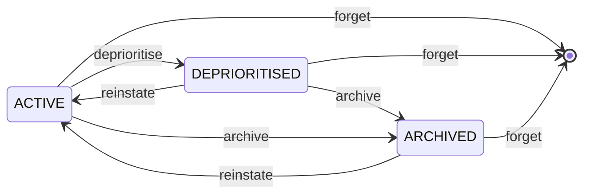

# Features in Depth

The bits no other memory system has: a proper lifecycle, a graveyard of dead ends, experience scoring, deduplication, contradiction detection, a one-call briefing, and background maintenance. The [skill compiler](skill-compiler.md) has a page of its own.

## Memory is not binary

Most systems remember or forget. OmniMem has a lifecycle:



| State | Recall weight |
|---|---|
| `ACTIVE` | 1.0x |
| `DEPRIORITISED` | 0.2x |
| `ARCHIVED` | 0.0x |
| `DELETED` | gone |

When you say "forget about X" you do not usually mean destroy it. You mean stop surfacing it. OmniMem deprioritises rather than deletes, applying a surface score multiplier at recall time. If something becomes relevant again later it can earn its way back.

Use `deprioritise` when something should stop surfacing but might be needed again someday. Add `reinstate_hints` to describe what should bring it back. If a future query strongly matches a hint, the memory resurfaces with a note explaining why it was deprioritised in the first place.

Use `archive` for content that is definitely outdated but has historical value worth keeping.

Use `forget` only when you want something permanently gone. It requires `confirm=True` so nothing disappears by accident.

One thing worth knowing: if you deprioritise a memory with `effort_score >= 4` the system will flag it before letting you proceed. It is not blocking you, just making sure you meant to soft-suppress something that was genuinely hard to figure out.

You can also suppress entire topics. Calling `suppress_topic("pisource.org")` means nothing touching that topic surfaces in any recall, across any session, until you lift it.

For the full storage model behind all of this, see the [memory type specifications](memory-types.md).

## The Graveyard

OmniMem tracks not just what worked but what did not and why.

Every abandoned approach gets logged with its name, type, and reason for failure. Before Claude suggests a library or architectural pattern the graveyard is checked first. If you tried something before and gave up on it, that warning surfaces at the top of results before anything else does.

```
WARNING: previously abandoned approaches match this query

  onnxruntime       library     SIGILL crash on Alpine musl libc       effort: 4/5
  FLAT index        approach    too slow above 10k vectors              effort: 3/5
  openai embeddings service     API cost and latency were prohibitive   effort: 2/5
```

Dead ends do not get a second chance to waste your afternoon.

## Experience scoring

Not all successful memories are equal. Something that worked first time is useful. Something that took four attempts, two abandoned libraries, and a weird Alpine-specific workaround to crack is gold, and it should surface more readily.

OmniMem assigns an experience weight to every memory based on effort and outcome:

| Effort | Meaning | Recall weight |
|---|---|---|
| 1 | Worked first time | 1.0x |
| 2 | Minor friction | 1.1x |
| 3 | Multiple iterations | 1.25x |
| 4 | Significant struggle | 1.5x |
| 5 | Battle-hardened | 1.8x |

The recall score formula:

```
score = similarity x surface_score x recency x experience_weight
```

A score-5 success is worth nearly twice as much in recall ranking as something trivial. Knowledge earns its rank.

## Semantic deduplication

Over time memory systems accumulate near-identical entries. OmniMem catches this at two points.

At write time, `remember()` embeds the new content and checks for existing memories above a cosine similarity threshold (default 0.92, configurable via `DEDUP_SIMILARITY_THRESHOLD`). If a near-identical memory already exists it returns the duplicate instead of storing a redundant copy. Pass `force=True` when you genuinely want both versions.

For bulk cleanup, `find_duplicates()` scans an entire namespace, batch-embeds everything, computes pairwise similarity, and returns clusters of duplicates grouped by union-find. Point it at your episodic namespace once a month and archive the extras.

## Contradiction detection

The graveyard warns you about things that failed. Contradiction detection warns you about things that disagree with each other.

When `remember()` stores a new memory it runs a fast heuristic check — finding semantically similar memories and scanning for negation pattern mismatches (e.g. one says "use X" while the other says "avoid X"). If a potential contradiction is detected it stores the memory but returns a warning so you can investigate.

For deeper analysis, `check_contradictions()` can optionally call Claude Haiku (Tier 2) to evaluate candidate pairs. Confirmed contradictions are cross-linked on both memories and flagged whenever either one surfaces in a `recall()`.

```
contradiction_warning:
  existing_key: mem:episodic:01ARZ3NDEK...
  existing_content: "Always use connection pooling for Valkey..."
  explanation: "These memories discuss the same topic but contain opposing language"
```

## Session briefing

Instead of making three separate calls at session start, a single `briefing(project="myproject")` returns everything Claude needs to get up to speed:

- **Project context** — current state, stack, last update
- **Experience summary** — effort stats, graveyard, breakthroughs
- **Stale memories** — active memories not updated in 30+ days (configurable via `STALE_MEMORY_DAYS`)
- **New knowledge** — RSS articles ingested in the last 7 days
- **Contradiction warnings** — memories with unresolved contradictions
- **Reinstate candidates** — deprioritised memories whose reinstate hints match current work
- **Suppressed topics** — what is currently filtered out
- **Skill suggestions** — compiled skills relevant to the current work, as a recommendation rather than an auto-load. On an ongoing project they sit below project context; on a greenfield project with no context yet they move to the top, because there the skill is the only thing carrying your conventions
- **Skill updates** — one-line gists where a skill's source memories changed since it was last compiled, with prominence scaled to risk
- **Auto-proposed skills** — at most once per `SKILL_SCAN_INTERVAL_HOURS` (default 24), a scan across all projects proposes drafts for domains whose lessons recur strongly enough to earn a skill (cross-project patterns by default) and for changed skills. Proposals only — a human still reviews and accepts every draft, and an ignored draft is not raised again until the lessons change

One tool call, one response, full context.

## Cross-project recall by work type

Memory scoped to one project answers "what did we decide here". It does not answer "what have I learned the hard way about Python", which is the question you actually have when you hit a familiar-feeling problem in a project you started last week.

Projects declare **work-type domains** — the kinds of work inside them:

```python
set_project_context(
    project_name="omnimem",
    description="Self-hosted semantic memory MCP server",
    stack="Python 3.12, FastMCP, Valkey",
    goals="Ship v6.6",
    current_state="v6.6.x branch",
    domains=["python", "docker", "htmx"],
)

recall("valkey tag filter behaviour", domain_filter="python")
```

That searches every project declaring `python`, not just the one you are sitting in. `project_filter` and `domain_filter` intersect when both are given, and `list_projects(domain="python")` shows which projects a domain covers.

Three things make it work rather than turn into a tagging chore:

- **It shares the compiled-skill vocabulary.** A project domain and a skill domain normalise through the same code, so `py` becomes `python` in both and the same name reaches `find_skills()`. Skills carry the lessons that cleared the reinforcement gate; the domain filter reaches the raw memories underneath — including the gotcha you hit twice that never became a rule.
- **Domains suggest themselves.** `compile_project_domains(name)` reads the project's existing stack field and the tags that recur across its memories, and proposes a list with the evidence for each entry. It proposes by default, writes only on `auto_save=True`, and never removes a domain you set by hand. A startup migration seeds domains from `stack` on upgrade, so the filter is not empty on day one.
- **An unmatched domain says so.** Filter on a domain no project declares and the search runs unscoped with a leading notice telling you the filter was not applied. A global search dressed up as a targeted one is worse than no filter at all.

Domains route; they do not label individual memories. A project is Python *and* CSS *and* Docker at once, so stamping those onto every memory would surface a CSS gotcha in a Python search. The domain narrows which projects are candidates, and the vector search still decides what is actually relevant inside them.

## Automatic maintenance

Memory systems accumulate duplicates and contradictions over time. OmniMem handles this automatically.

Every N `briefing()` calls per project (default 10, configurable via `AUTO_MAINTENANCE_INTERVAL`), the server runs a maintenance pass:

1. **Dedup scan** — finds clusters of near-identical episodic memories and archives the oldest in each cluster, keeping the newest
2. **Contradiction scan** — checks semantically similar active project memories for negation pattern mismatches (requires cosine similarity >= 0.5 before checking, capped at 10 results)
3. **Knowledge expiry** — archives RSS-ingested knowledge articles that have passed their `expires_at` timestamp (default 30 days after ingestion, configurable via `MAX_KNOWLEDGE_AGE_DAYS`). Manually stored knowledge items are never affected

The results appear in the briefing response under `auto_maintenance` so you know what was cleaned up. Set `AUTO_MAINTENANCE_INTERVAL=0` to disable. Manual `find_duplicates()` and `check_contradictions()` calls still work as before.

## See also

- [The skill compiler](skill-compiler.md) — distil experience into loadable SKILL.md documents
- [MCP tool reference](mcp-tools.md) — every tool these features expose
- [Architecture](architecture.md) — how the recall pipeline applies all of this
