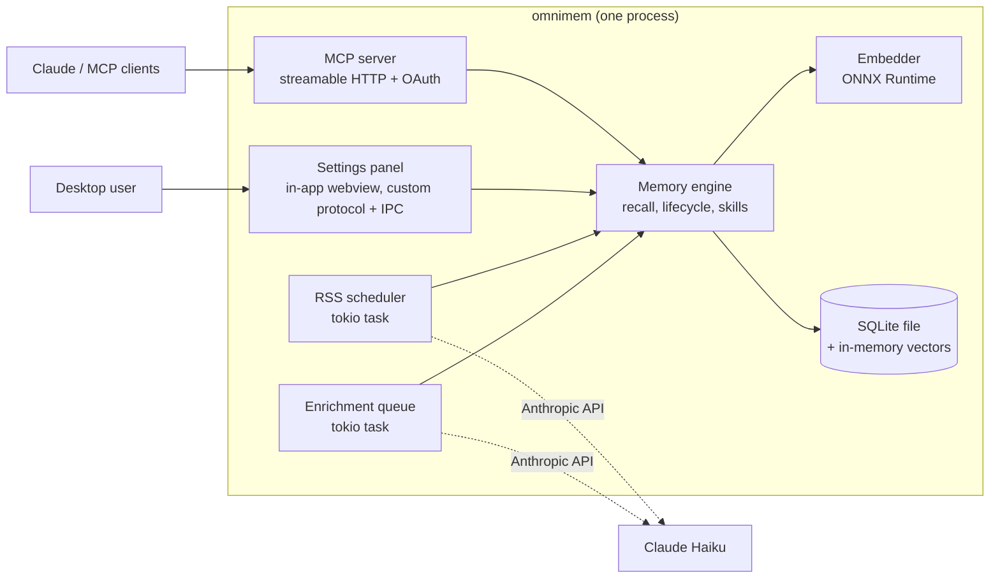

# OmniMem 7: the Rust port

**Status**: in progress on `v7.0.x`. This is the working plan; update it as phases land.

OmniMem 7 is one Rust binary. It replaces four containers (Valkey with the search module, the Python MCP server, the Python web UI and the Python RSS worker) with a single process that holds its own vector store, serves MCP and runs RSS ingestion on a schedule. Settings, and everything the 6.x web UI showed, live in a panel inside the desktop app. Over the network it serves MCP and the OAuth flow that protects it, and nothing else.

It ships three ways: as desktop installers (an MSI for Windows, a DMG for macOS, a Flatpak for Linux) that run OmniMem with a tray or menu bar icon and a native settings window; as headless Linux packages (`.deb`, `.rpm` and a tarball) that install a systemd service with no desktop dependencies; and as a headless Docker image.

The Python tree was the reference implementation through phase 8 and has now been removed from this branch (6.x carries on in the `v6.x` branches). The golden fixtures captured from it stay, with the scripts that took them, which run against a `v6.7.x` checkout.

## Progress

| Phase | State | Evidence |
|---|---|---|
| 0. Foundation | **Done** | Rust vectors match the Python engine's full reference vectors (`crates/omnimem-embed/tests/fixtures`) within 1e-4, cosine > 0.99999. Model download into the shared Hugging Face cache, tested against a local HTTP server |
| 1. Store | **Done, one item carried** | Real 6.6.2 production backup (3,500 memories, 4,356 keys): imported and embedded in 147 s (debug build, sharing the CPU), 12.8 MB database. All 32 query/namespace searches return an **identical ordered top-10** to the Python engine's exact search over the same data. Export round-trips every field of every memory, adding only the v7 identity fields. `migrate_project_domains` landed with phase 3 and runs at startup and after an import or restore. Carried: proving the Flatpak's offline ONNX Runtime source (phase 9 prep) |
| 2. Core MCP | **Done, one check left** | `omnimem-engine` ports the recall pipeline (abandoned fast-path, scoring with surface, recency, experience and temporal multipliers, reinstate candidates, fact collapse, relevance floor and weak band, recall logging and counters), lifecycle and suppression, dedup, the tier-1 contradiction check, chunking, domain routing and the core tool behaviours. `omnimem-mcp` serves 20 tools over streamable HTTP with 6.x's verbatim descriptions, bearer auth, Host/Origin allowlists and fail-closed public binds; `omnimem serve` runs it. Checked with a real MCP session against the imported production store and the real model: recall 65 to 90 ms on a debug build. Left: connecting Claude Code itself. Deferred to phase 5: query expansion (`expand_queries` is accepted and ignored). Enrichment jobs are queued durably but nothing consumes them yet |
| 3. Experience, projects, briefing | **Done, two items move to phase 4** | 23 more tools, 43 in all: experience (`record_experience`, `log_abandoned`, `get_experience`, `experience_summary`, `warn_if_abandoned`), projects (context, domains, state, bulk delete, deprioritise and reinstate, `compile_project_context`), audit (`memory_audit`, `why_did_you_mention`, `explain_memory`, `reindex`), `set_licence` and `set_provenance` through one lineage stamp, tier-1 `check_contradictions`, `recent_knowledge`, and `briefing` with auto-maintenance (dedup archive, contradiction scan, article expiry). `migrate_project_domains` runs at startup and after import or restore. 17 new engine tests; 133 across the workspace, clippy clean. Checked over a real MCP session on the imported production store with the real model: every new tool answers, 2 to 146 ms on a debug build (`briefing` 139 ms, `memory_audit` over 3,497 memories 134 ms), and `reindex` reports vectors equal to records in all five namespaces. Not yet compared field by field with the Python tools, which needs a Valkey loaded with the same backup. Moved to phase 4 with the skill compiler: the briefing's skill sections and `promote_knowledge`. `reindex` now reloads vectors and can never find phantoms |
| 4. Skills | **Done** | `compile_skill` (propose and write, the stale-proposal and authored-work refusals, export), `find_skills`, `get_skill`, `bless` and `promote_knowledge` with extracted rules: 48 tools. The briefing's skill sections (suggestions, pending updates, the time-gated auto scan with its seen-sha gate, the knowledge watch), feed influence read from the mirrored `meta:feed:influence` hash, and skill transfer bundles (export, validate, plan, apply, feed merge) in the engine for the web UI to call. The pure functions are checked against a golden fixture the 6.7.1 Python wrote for the same inputs (`crates/omnimem-engine/tests/fixtures/skills_golden.json`): lesson extraction, rule-change summaries, review notes and four rendered bodies, byte for byte. Real data, the imported production store with the real model: `opentofu` and `preferences` recompile **unchanged**; `wcag-accessibility` proposes exactly one kind of change, seven Feed watch articles from a feed whose influence (7) was set after that skill was compiled, which 6.x would propose too. `find_skills` scores match the Python ONNX engine on the same store to four places (0.6189, 0.4922, 0.3426; `python` at 0.2341 is under the floor in both). A briefing with skills takes 430 ms on a debug build, and 6.7 s when the daily auto scan runs. 157 workspace tests. Left for later phases: writing the feed mirror (phase 6) and the web UI's export and import screens (phase 7). The skill banner still says Valkey, because changing it would turn every recompile into a diff; that changes at cut-over |
| 5. LLM features | **Done, one live check left** | `omnimem-llm` is a blocking Anthropic Messages client that keeps the SDK behaviour 6.x relied on (two retries on connection failures, 408, 409, 429 and 5xx, honouring `retry-after`), behind a `LanguageModel` trait in `omnimem-core` so the engine is tested with a scripted model. The engine ports fact extraction with the 6.x prompt, fence stripping and event-date parsing; the enrichment worker, a thread in `serve` draining the durable queue (preferences routed to `preference`, the event-date fallback chain, licence and provenance inherited from the live source, duplicate facts skipped, batch mode); query expansion with the `qexp:` cache, each variant scored through the same path as the query; and contradiction tier 2 with the 6.x prompt. 171 workspace tests, including the client against a local HTTP server. Smoke-tested on the imported production store with no key: `serve` says the features are off, a full-mode `remember` queues a job the worker drains within a second, `recall(expand_queries=True)` answers from the original query, and `check_contradictions(use_api=True)` confirms nothing, as 6.x degraded. Left: a run against the real API with `ANTHROPIC_API_KEY` set. Two deliberate differences: the worker looks at the queue every second where 6.x blocked on `BRPOP`, and the request timeout is two minutes rather than the SDK's ten |
| 6. RSS | **Done** | `omnimem-rss` ports the worker into `serve` as a thread sharing the engine: `feed-rs` parsing, summary and digest modes with the 6.x prompts, refusal phrases and truncation fallback, the teaser page fetch with its byte cap, the licence gate before any fetch (`RSS_REQUIRE_LICENCE`), project labels, dedup by URL hash, expiry, and the `meta:feed:influence` mirror written each cycle. It runs at start, every `RSS_SCHEDULE_HOURS`, and when `feeds.yml` changes; `omnimem rss` runs a cycle by hand and `--dry-run` shows what would be ingested. `feeds.yml` defaults to the database's folder, and `FEEDS_CONFIG_PATH` still wins. Checked against 6.x on the repository's own `feeds.yml` (six live feeds): Rust and Python feedparser, through the 6.x ingester's own helpers, agree on all 59 articles, in the same order, with identical keys, titles, links, publication times and stripped text, and both fail the same dead feed. A real cycle with no key stored and embedded all 59 with truncated summaries in 4.9 s on a debug build; the next skipped all 59 in 1.7 s. 185 workspace tests, including ingestion end to end against a local HTTP server and the file-change trigger. Differences: a feed that can't be fetched is logged rather than silently empty, the summariser relies on the client's retries instead of adding its own, and `RSS_SCHEDULE_HOURS=0` means no scheduled runs rather than an error |
| 9a. Desktop shell | **Done, pulled forward** | `omnimem-app` holds what the server and the app share: `run_services` opens the engine and runs the enrichment worker, the RSS scheduler and the MCP server, reporting starting, running (with the MCP URL and memory count), failed or stopped, and checks the fail-closed bind rule before anything opens. It also has the per-platform data folder and the single-instance lock with a show-window request. `omnimem serve` now runs on it. `omnimem-desktop` is the app: the event loop on the main thread, the services on a background thread, a tray or menu bar icon whose menu shows the status and offers Settings, Copy MCP URL, Start at login and Quit, and a settings window whose page comes from the process over `omnimem://` and talks back over IPC, with no network listener. Without a tray (GNOME without the AppIndicator extension) it opens the window instead. The page is a status placeholder until phase 7. `omnimem` with no command runs the app when built with the `desktop` feature; the GUI crate is outside the default members, so host builds need no GTK. `scripts/desktop-check.sh` builds it in a Debian trixie container pinned to the host toolchain and passes clippy with warnings denied, its unit tests, and `omnimem desktop --smoke-test` under Xvfb and D-Bus, which creates the tray and window, loads the page and completes an IPC round trip. Not yet exercised: a real desktop session on any platform, the macOS menu bar and Windows tray (those need the runners), and start at login. libayatana-appindicator reports itself deprecated in favour of its glib variant, which tray-icon doesn't use yet |
| 7. Settings panel | **Done** | `omnimem-settings` is an axum router never bound to a socket: the window's `omnimem://` handler passes each request to `Panel::handle`, which runs the route in-process. The 6.x Jinja2 templates and static files are embedded at build time and rendered with minijinja (Python compatibility methods on, HTML escaped exactly as markupsafe does); the template expressions minijinja can't parse were rewritten (`"{:,}".format` became a `thousands` filter, a `round` call gained brackets) and the login form is gone. Pages that need the engine show a starting page until the services hand it over, or the reason they stopped. Ported: the dashboard (stats cache, `?refresh=1`, queue indicator), `/version-check`, `/memories` (filters, paging, htmx rows, heat), `/memory/{key}` with the tag, licence and provenance forms (through `retag`, `set_licence` and `set_provenance`, so facts follow and `updated_at` is untouched), `/lifecycle/*` with the same-site `next` rule, `/create` with the duplicate check and namespace defaults, `/search` with weak matches marked, `/projects` (domain chips and filter, create, edit keeping `created_at`, the domain suggestion partial, delete, and bulk deprioritise and reinstate through the MCP tools' engine calls), `/experience` with its htmx rows and the graveyard, and `/skills` (list with pending proposals, detail, the New Skill modal through the same `compile_skill` propose-and-write gate with existing skills refused, delete, and transfer bundles). Export can't rely on a webview download, which WebKitGTK saves silently and macOS won't report, so the zip is written into the Downloads folder without overwriting and the page says where it went. Import takes a multipart upload (bundles up to 20 MB), previews under a one-shot 30-minute token and, on confirm, folds bundled feed influences into `feeds.yml` (the panel is told the reading list's path by the app) and the influence mirror. Then the management pages: `/duplicates` (scan on stored vectors, with the last auto-maintenance run noted), `/contradictions` (each recorded pair once, both sides read in one batch), `/suppressions`, `/telemetry` (most recalled, gone cold after `TELEMETRY_COLD_DAYS`, never recalled, skills included), `/token-overhead`, `/feeds` (the reading list editor with licence classes, a stale note dropped on reclassification, skill influence rows, and upload and download of `feeds.yml`, every change mirrored for the skill compiler) and `/backups` (create, upload up to 100 MB, preview, restore through `restore_from_file` so every migration runs and memories are re-embedded, download and delete). Token overhead no longer hardcodes 6.x's character counts: `omnimem_mcp::context_overhead` measures the instructions, the serialised tool schemas and the deferred tool names from what the server actually sends, and the app hands the numbers to the panel so the settings crate needs no MCP dependency; tool usage comes from the `meta:tool_metrics:*` counters the server already keeps. Downloads of backups and `feeds.yml` are saved into the Downloads folder, as skill exports are. Two things the webview forced: wry's `linux-body` feature, without which WebKitGTK hands the custom scheme empty POST bodies (so WebKitGTK 2.40 or later is required), and redirects, which WebKitGTK doesn't follow from a custom scheme, so a form's answer is a page that replaces itself with the target rather than a 303. The container smoke test submits a real form and fails if the window doesn't land. `/configuration` covers the settings a headless install sets as environment variables, grouped (MCP server, Claude, recall, RSS, skills, embeddings, the panel) with their defaults and a note when a real environment variable overrides one. Ordinary settings go to `omnimem.env` in the data folder, validated as a whole before anything is written, keeping any hand-written lines; secrets (`ANTHROPIC_API_KEY`, `MCP_AUTH_TOKEN`, `HF_TOKEN`) go to the OS keychain through the `keyring` crate (Keychain Services, Credential Manager, the Secret Service over pure-Rust D-Bus) and are never shown again. Settings apply at the next start: the desktop app reads the file and the keychain before anything else runs and installs them as an overlay in `omnimem_core::env`, which every crate now reads settings through, environment first. Nothing writes to the process environment, which isn't sound once the keychain has started threads. `omnimem serve` never installs the overlay, so headless installs stay environment-only. The Flatpak manifest will need `--talk-name=org.freedesktop.secrets` (phase 9b). `/metrics` stays gone, as decided |
| 8. OAuth and hardening | **Done, one live check left** | `omnimem-mcp`'s `oauth` module is the authorisation server FastMCP gave 6.x, hand-built on axum: RFC 8414 and RFC 9728 discovery, dynamic client registration (public clients get no secret and use PKCE alone), `/authorize` with S256 PKCE, the login page with its constant-time credential check and per-address rate limit, `/token` for codes and refresh tokens with rotation, the grace-window replay and the absolute chain cap, `/revoke`, and the connector icon. `/mcp` takes the shared bearer token, an OAuth access token, or either, with 6.x's `WWW-Authenticate` challenges; the fail-closed rule counts OAuth as authentication. The HTTP surface is checked byte for byte against a capture of the 6.x provider under FastMCP 4.0.3 and mcp 2.1.1 (`crates/omnimem-mcp/tests/fixtures/oauth_golden.json`, with the script that took it): the 12 routes and nothing else, both discovery documents, the challenges, CORS preflights, every registration, authorisation and token error, and the token and registration bodies. Clients, codes and tokens live in schema 3's `oauth_clients`, `oauth_codes` and `oauth_tokens`, codes and tokens keyed by their SHA-256 so the database holds nothing a client could present; a code is consumed and a refresh token rotated inside one transaction. Every 6.x setting is honoured (`OAUTH_ENABLED`, `OAUTH_BASE_URL`, the admin user and password, `OAUTH_REFRESH_MAX_DAYS`, `OAUTH_REFRESH_GRACE_SECONDS`, `OAUTH_LOGIN_MAX_ATTEMPTS`, `OAUTH_LOGIN_WINDOW_SECONDS`) and the configuration page has an OAuth group, the password going to the keychain. Smoke-tested with the real binary and curl: discovery, the 401 challenge, register, authorise, sign in, exchange, `initialize` on `/mcp` with the access token, the grace-window replay, the login limit (401, 401, 401, 429), and a clean restart after which the old access and refresh tokens still work. 268 workspace tests, clippy clean. Deliberate differences: OAuth switched on but incomplete refuses to start where 6.x logged a warning and ran without it; the Origin check accepts the server's own host whatever the scheme, which fixes 6.x's 403 on the login form behind a TLS-terminating proxy; revoking needs no `client_secret` field from a public client, which the SDK wrongly demanded; `OAUTH_VALKEY_MAX_CONNECTIONS` is gone with Valkey. A security review of the whole workspace followed (2026-09-16): the OAuth routes, the settings panel, bundle import, backups, the engine's tools and the RSS fetcher were all hardened; the CHANGELOG's 7.0.0 Security section lists the changes. Left: claude.ai connecting through a reverse proxy, and the desktop container check |

## Decisions

Settled on 2026-09-15:

| Question | Decision | Why |
|---|---|---|
| Storage | **SQLite, vectors searched in memory** | One file, `rusqlite` bundled so there is no system library. At OmniMem's scale (tens of thousands of memories) exact cosine search over a 384-dim matrix is under 10 ms and deterministic, which the v7 clustering rules require. FTS5 comes for free for the hybrid keyword search in `TODO.md`. An HNSW index can be added behind the same trait if a store ever outgrows exact search |
| Moving data | **Import a 6.x backup file** | `omnimem import <dump.json>` reads the existing `dump_to_file` format and re-embeds (backups carry no vectors). About 8 ms per memory on ONNX, so 25,000 memories take roughly 3.5 minutes. No Valkey client in the binary |
| Scope | **Parity port, v7 schema from day one** | Feature-for-feature, in phases. The new store includes `origin_id`, `content_hash`, `epoch` and `classification` from the start, because shaping an empty store correctly costs nothing. `cluster_profile` and the rest of the Mycelium adapter (`docs/v7-change-spec.md`) follow parity |
| Layout | **Cargo workspace beside the Python** | `crates/` at the repo root. The Python suite documents what the Rust tests must prove |
| Installers | **MSI, DMG, Flatpak** | One per desktop platform, each running OmniMem with a tray or menu bar icon that shows it is running and opens settings |
| Settings UI | **A settings panel inside the app, never served over HTTP** | The tray icon opens a native window (tao + wry) whose pages are handed to the webview through a custom protocol and IPC, so no network listener serves them and nothing else on the machine or the network can reach them. It replaces the 6.x web UI entirely: the dashboard, memory, project, skill, feed, telemetry and backup pages move into the panel |
| HTTP surface | **`/mcp`, the OAuth 2.1 endpoints and `/healthz`, nothing else** | MCP clients need `/mcp`, and the OAuth flow (including the login page a browser is sent to) protects it. No web UI, no `/metrics` and no web sessions over HTTP |
| Build hosts | **Mac and Windows runners added to Forgejo** | Each installer is built and tested on its own OS. `sqcows` builds the Flatpak and the Docker image |
| Signing | **Apple Developer ID; no Windows certificate yet** | The .app and DMG are signed and notarised. The MSI ships unsigned, and its signing step runs as soon as a certificate secret exists |
| Headless Linux | **`.deb`, `.rpm` and `.tar.gz`, each with a systemd unit** | For servers and desktops without GNOME: the binary built without the `desktop` feature, so no GTK, WebKitGTK or tray dependency. Configured through `/etc/omnimem/omnimem.env` and the CLI: there is no web UI, and no desktop to host the settings panel |
| Architectures | **x86_64 and arm64 everywhere** | MSI x64 and ARM64, a universal macOS binary, Flatpak x86_64 and aarch64. ONNX Runtime publishes prebuilt libraries for all six targets |

## Architecture

One embedder instance serves every caller. Today each of the three Python services loads its own copy of the model.

### Crates

| Crate | Holds | Replaces |
|---|---|---|
| `omnimem-core` | Namespaces, keys, record types, validation, licence and provenance vocabularies, the v7 content hash | `memory/licence.py`, `provenance.py`, parts of `store.py` and `tools/core.py` validation |
| `omnimem-embed` | ONNX engine, model resolution (local dir, HF cache, download with revision pin) | `memory/onnx_embedding.py`, `embedder.py` |
| `omnimem-store` | SQLite schema and migrations, vector matrix, filtered exact k-NN, backup import and export | Valkey, `memory/store.py`, `migrations.py`, `tools/backup.py` |
| `omnimem-engine` | Recall pipeline, dedup, contradiction, lifecycle, experience, projects and domains, lineage, chunking, temporal, skills compiler, scan and transfer, maintenance, enrichment | the rest of `memory/` |
| `omnimem-llm` | Anthropic client with the summariser's retry classes | `extraction.py`, `query_expansion.py`, `summariser.py`, contradiction tier 2 |
| `omnimem-mcp` | The 48 tools, instructions, telemetry, auth (bearer and OAuth 2.1 server), Host/Origin guard | `server.py`, `tools/`, `oauth/`, `middleware/` |
| `omnimem-rss` | Feed fetch and parse, summary and digest modes, licence gate, scheduler | `rss_worker/` |
| `omnimem-settings` | The settings panel's pages (dashboard, memories, projects, skills, feeds, telemetry, backups, configuration), rendered in-process and handed to the desktop window over a custom protocol. No HTTP routes | `web_ui/` |
| `omnimem-desktop` | Tray and menu bar icon, the settings window, single-instance lock, start at login, first-run model fetch | new |
| `omnimem-app` | What the server and the desktop app share: opening the engine, running the services with state reports, the data folder, the single-instance lock. No GUI dependencies | `server.py` startup, `rss_worker/worker.py` |
| `omnimem` | The binary: subcommands (`serve`, `import`, `export`, `stats`, `search`, `embed`, `rss`, and `desktop` when built with the `desktop` feature, which is also what it runs given no command). Built with the feature for the installers, without it for Docker and the headless packages. The GUI crate is outside the workspace's default members, so a plain `cargo build` or `cargo test` needs no GTK | `docker-compose.yml` wiring |

## Storage

SQLite in WAL mode, one file (default `./data/omnimem.db`).

- **`memories`**: one row per memory. Typed columns for everything that is filtered, sorted or counted (`key` primary, `namespace`, `state`, `project`, `project_name`, `surface_score`, `created_at`, `updated_at`, `recall_count`, `last_recalled`, `effort_score`, `outcome`, `experience_weight`, `licence`, `provenance`, `feed_name`, `expires_at`, `domain`, `generated`, plus the v7 fields `origin_id`, `content_hash` (indexed), `epoch`, `classification`). Everything else in a `fields` JSON column, so a 6.x field with no column survives an import untouched
- **`vectors`**: `key` → 384 little-endian float32 bytes, the same encoding Valkey stored
- **`kv`**: `key`, `kind` (hash, set or string), `value` as JSON, `expires_at`. Replaces every `meta:*`, `log:recall:*`, `qexp:*` and `topics:suppressed` key, including recall logs and tool metrics, with expiry enforced on read
- **`enrich_queue`** (durable, so a crash no longer loses a job), **`oauth_clients`**, **`oauth_codes`**, **`oauth_tokens`** (codes and tokens keyed by SHA-256)
- **`store_meta`**: the store's `origin_id`

As built, the typed columns are generated from `fields` (`state`, `project`, `project_name`, `feed_name`, `created_at`, `updated_at`, `content_hash`) rather than stored separately. Tag and domain join tables and an FTS5 table for hybrid keyword search were planned and not built; they can be added in a later schema version.

Vector search: on start, load every vector into one contiguous matrix per namespace, kept in step with writes. A query computes dot products (vectors are unit length) against rows that pass the filter, then takes the top k. Filters are SQL, so the valkey-search tag-query quirks (`{a|b}` alternation, escaped values, `FT.DROPINDEX` arity) and index drift disappear with Valkey.

Numbers stored as REAL and INTEGER, not Python `str(float)`. Where a number is rendered into output that 6.x tests compare, it is formatted to match.

## Desktop app and installers

### What runs

The installed app is the same binary as the server, started in desktop mode. The engine, MCP server and RSS scheduler run on a tokio runtime in background threads, and the main thread owns the platform event loop (tao), which the tray and the window need on every OS and which macOS requires to be the main thread.

- **Tray / menu bar icon** (`tray-icon` + `muda`): present while OmniMem runs. The icon shows state (running, starting, needs attention) and the menu offers:
  - status line: memory count and the MCP address
  - **Settings…**: opens the settings window
  - **Dashboard…**: opens the same window on the dashboard
  - **Copy MCP URL**: for pasting into a client's config
  - **Start at login** (checkbox)
  - **Quit**
- **Settings window** (`wry` in a `tao` window): the panel's pages come from the process through a custom protocol (`omnimem://`) and changes go back over IPC, so there is no loopback server, no session and no login page, and nothing outside the window can reach them. One window at a time; closing it leaves OmniMem running in the tray. Windows uses WebView2 (present on Windows 10 and 11, bootstrapped by the MSI where missing), macOS uses WKWebView, Linux uses WebKitGTK
- **Settings panel** (phase 7): the 6.x web UI's pages (dashboard, memories, projects, skills with export and import, feeds, telemetry, backups), plus everything that is an environment variable today and matters on a desktop, including the MCP port and auth token, the Anthropic API key, RSS feeds and schedule, recall and skill thresholds, data folder, backups. Changes are written to a config file in the data folder; ones that need a restart (port, data folder) say so
- **Single instance**: a lock file in the data folder. Launching a second copy brings the settings window forward instead of starting another server
- **Start at login**: `auto-launch` on Windows (Run key) and macOS (login item); on Linux the Flatpak asks the Background portal
- **First run**: the tray says OmniMem is starting, and the settings window explains, while the engine loads the embedding model, downloading it if it isn't cached (the phase 0 download piece), then starts serving
- **Data location** (`directories`): `%APPDATA%\squarecows\OmniMem\data` on Windows, `~/Library/Application Support/com.squarecows.OmniMem` on macOS, `$XDG_DATA_HOME/omnimem` on Linux (inside the Flatpak, `~/.var/app/<app-id>/data/omnimem`). The database, `feeds.yml`, backups and the single-instance lock live there; `OMNIMEM_DB` still overrides it. The model cache moves there with the installers

Headless mode (`omnimem serve`, or a build without the `desktop` feature) has no tray, no window and no GUI dependencies, and is what the Docker image runs. It has no settings panel either: it is configured by environment variables (or `/etc/omnimem/omnimem.env`) and the CLI.

### Installers

| Platform | Artefact | Built on | How |
|---|---|---|---|
| Windows | `OmniMem-<version>-x64.msi`, `-arm64.msi` | Windows runner | `cargo wix` (WiX Toolset). Per-user install, Start menu entry, optional start at login, WebView2 bootstrapper. ONNX Runtime DLL installed beside the exe. Signed with `signtool` when a certificate secret is configured, unsigned until then |
| macOS | `OmniMem-<version>.dmg` (universal) | Mac runner | Build `aarch64-apple-darwin` and `x86_64-apple-darwin`, merge with `lipo`, bundle `OmniMem.app` with `LSUIElement` so it lives in the menu bar with no Dock icon, sign with the Developer ID and hardened runtime, notarise with `notarytool`, staple, wrap in a DMG with an Applications link |
| Linux | `com.squarecows.OmniMem.flatpak`, x86_64 and aarch64 | `sqcows` | Flatpak manifest on the GNOME runtime (WebKitGTK included), `libayatana-appindicator` built as a module for the tray, network and `org.kde.StatusNotifierWatcher` permissions. Flatpak builds are offline, so cargo sources are vendored with `flatpak-cargo-generator` and ONNX Runtime comes in as an archive source pointed to by `ORT_LIB_LOCATION` rather than the build-time download |

| Linux, headless | `omnimem_<version>_amd64.deb` / `_arm64.deb`, `omnimem-<version>.x86_64.rpm` / `.aarch64.rpm`, `omnimem-<version>-linux-<arch>.tar.gz` | `sqcows` | The same binary built without the `desktop` feature: no GUI libraries at all, so it installs on a minimal server or a desktop without GNOME. `cargo deb` and `cargo generate-rpm` package it with a systemd unit (`omnimem.service`, running `omnimem serve` as a dedicated `omnimem` system user), `/etc/omnimem/omnimem.env` for configuration, and `/var/lib/omnimem` for the database, backups and model cache. The tarball carries the binary, the unit file and an `install.sh` for other distributions. ONNX Runtime is linked in, so the only runtime dependency is glibc |

The Docker image (`omnimem` headless, multi-arch) is built on `sqcows` alongside, replacing the three 6.x images.

### CI

A `release.yml` workflow on version tags, in the existing Forgejo Actions setup:

- a `test` job on each runner (Linux, Mac, Windows) before any packaging, so a platform-specific failure stops its own installer
- `msi` (Windows runner, x64 and ARM64), `dmg` (Mac runner), `flatpak` (sqcows, both arches), `linux-headless` (sqcows: deb, rpm and tarball for both arches, plus a smoke test that installs the `.deb` in a clean Debian container and checks `systemctl` starts the service) and `docker` (sqcows)
- artefacts attached to the Forgejo release with SHA-256 checksums
- secrets: Apple signing certificate and password, notarisation API key, Windows signing certificate (empty for now, which skips the step)

Setting up the two runners is a prerequisite: register each in host mode with the declarative Forgejo Runner 13 flow and labels such as `macos` and `windows`, since `runs-on` must match a label exactly or the job queues forever.

### Risks

| Risk | Mitigation |
|---|---|
| GNOME shows no tray icons without the AppIndicator extension | The settings window can also be opened from the app's launcher entry; relaunching focuses it. Document the extension |
| Flatpak's offline build versus `ort`'s binary download | ONNX Runtime provided as a manifest source, as above; verified early rather than at release time |
| WebView2 missing on older or locked-down Windows | Evergreen bootstrapper in the MSI; if it still fails, the tray says so and settings fall back to the config file in the data folder, since there is deliberately no browser version |
| An unsigned MSI triggers SmartScreen | Documented until a certificate is bought |

## Compatibility contract

What a 6.x user must not notice:

1. **MCP tools**: the same 48 names, parameters, defaults and descriptions (docstrings are copied verbatim, agents read them), and results in the same JSON shape, including `_compact()` dropping empty values
2. **Vectors**: identical to the Python engine (`crates/omnimem-embed/tests/fixtures/reference_vectors.json`), so recall thresholds and skill clustering carry over
3. **Recall scoring**: floor, weak band, recency decay, experience weight, temporal boost, reinstate 0.6, fact collapse and ordering exactly as `memory/recall.py`
4. **Skill bodies**: `render_skill_md` byte-identical, including `json.dumps` escaping non-ASCII in the description line, or every existing skill shows a spurious diff after import
5. **Files**: backup JSON, skill bundle zips (format v2, reads v1), `feeds.yml`
6. **Configuration**: every 6.x environment variable honoured with its default, except the Valkey and web UI ones (`WEB_UI_*`), which are dropped. Settings can also be changed in the desktop app's settings panel
7. **Web UI**: not kept. Its pages move into the settings panel, which is not reachable over HTTP, so bookmarks to the 6.x web UI stop working. `/metrics` goes with it; the telemetry it exposed is shown in the panel

Deliberately not kept: Valkey, the web UI and `/metrics` over HTTP, SSE transport (streamable HTTP only), `EMBEDDING_BACKEND=torch`, the per-process suppressed-topics cache (one process now), at-most-once enrichment.

## Phases

Each phase ends with a commit that builds, passes its tests, and is usable for what it covers.

| Phase | Delivers | Done when |
|---|---|---|
| **0. Foundation** | Workspace, `omnimem-core` (keys, content hash), `omnimem-embed` | Rust vectors match `reference_vectors.json` within 1e-5 |
| **1. Store** | Schema and migrations, vector matrix, filtered k-NN, backup import and export | A real 6.x backup imports, and `recall`-shaped queries return the same top 10 as Python on the benchmark corpus |
| **2. Core MCP** | Server on streamable HTTP with bearer auth; remember, remember_document, recall, recall_index, recall_detail, lifecycle, retag, forget, suppressions, dedup, contradiction tier 1, version, health, backup tools | Claude Code connects and a session works end to end |
| **3. Experience, projects, briefing** | Experience tools, project tools and domains, licence and provenance, lineage, briefing, audit, maintenance | The full session-start flow from `claude_config/CLAUDE.md` works |
| **4. Skills** | Compiler, propose-and-accept, find/get/bless, scan, knowledge watch, promotion, transfer bundles | Imported skills recompile with no diff |
| **5. LLM features** | Enrichment queue, fact extraction, query expansion, contradiction tier 2 | Behaviour matches with `ANTHROPIC_API_KEY` set and degrades the same without it |
| **6. RSS** | Feeds, summary and digest modes, licence gate, scheduler, feed influence | A feeds.yml from 6.x ingests the same articles |
| **7. Settings panel** | The 6.x web UI's pages and a configuration page for what is environment-only today, as the desktop app's settings panel: rendered in-process (minijinja) and served to the window over a custom protocol and IPC, with skill export and import on the phase 4 transfer engine | Every panel page renders against an imported store, and the only HTTP routes the binary serves are `/mcp`, OAuth and `/healthz` |
| **8. OAuth and hardening** | OAuth 2.1 server (register, authorize, token with PKCE, refresh rotation with grace window, revoke), Host/Origin guard, fail-closed public bind. The OAuth login page is the only HTML served over HTTP | claude.ai connects through a reverse proxy |
| **9a. Desktop shell** (pulled forward, before phase 7) | `omnimem-app` (the services the server and the app share, the data folder, the single-instance lock) and `omnimem-desktop` (tray or menu bar icon and menu, settings window on the `omnimem://` scheme with IPC, start at login, a smoke test), built and smoke-tested on Linux in a container by `scripts/desktop-check.sh` | The desktop build shows the tray, opens the window and round-trips over IPC under Xvfb, and the host build stays free of GUI libraries |
| **9b. Installers and release** | MSI, DMG and Flatpak packaging, headless `.deb`, `.rpm` and tarball with a systemd unit, Mac and Windows runners, `release.yml` with signing and notarisation | A tagged build produces every installer; each installs cleanly on its OS and architectures; the desktop ones show the icon and open settings, and the headless ones start the service on a system with no desktop libraries installed |
| **10. Cut-over** | Headless Docker image, docs, delete the Python tree | 7.0.0 |
| **11. Mycelium** | `cluster_profile`, freshness, by_hash, classification filter, epoch bumps | `docs/v7-change-spec.md` |

The desktop shell was pulled forward as 9a, ahead of phase 7, because the platform event loop decides how startup is structured and the settings panel is served through its window. The Flatpak's offline ONNX Runtime source still has to be proven before 9b.

## Testing

- The Python suite is the specification. Each Rust module ports the behaviour its Python tests assert, not the fakes
- **Golden files** from the Python implementation for everything with a byte-level contract: vectors, skill bodies, bundle manifests, backup exports, recall orderings on a fixed corpus
- **No fakes for the store.** SQLite runs in memory in tests, so the fake-diverges-from-server failure behind the 6.6.0 index migration bug can't recur
- The real model runs in tests when the Hugging Face cache has it, and is skipped with a message when it doesn't

## Known hard parts

| Area | Problem | Plan |
|---|---|---|
| `dateparser` | No Rust crate parses relative dates in prose ("last Tuesday") the same way | Port the pre-filter regex, handle the phrases the temporal tests cover, golden-test against Python on a phrase corpus, and accept documented differences beyond it |
| OAuth 2.1 server | `rmcp` provides no authorisation server; FastMCP did | Hand-build on axum with the storage semantics in the inventory, including the rotation grace window |
| `render_skill_md` | Must match `json.dumps` defaults and `difflib.unified_diff` output | Implement the json escaping exactly; port unified diff and golden-test it |
| Templates | 35 Jinja2 templates, written for htmx over HTTP | minijinja is close to Jinja2; port them into the panel, with htmx requests going over IPC instead of HTTP |
| Regex lookaround | The sentence chunker uses lookbehind | `fancy-regex`, already a dependency of the tokeniser |
| `feedparser` | Normalises many malformed feeds | `feed-rs`, with the 6.x feed list as a test corpus |
