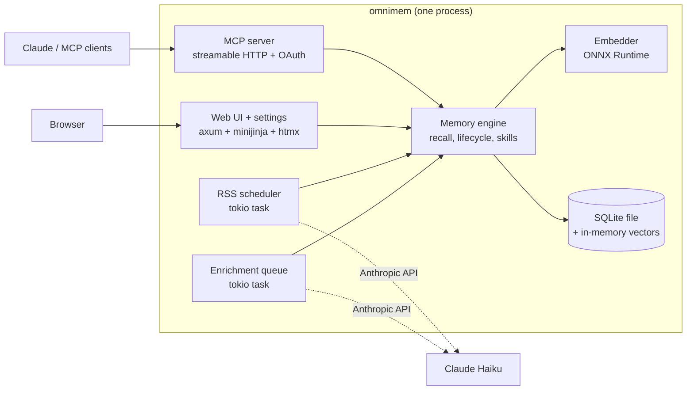

# OmniMem 7: the Rust port

**Status**: in progress on `v7.0.x`. This is the working plan; update it as phases land.

OmniMem 7 is one Rust binary. It replaces four containers (Valkey with the search module, the Python MCP server, the Python web UI and the Python RSS worker) with a single process that holds its own vector store, serves MCP, runs RSS ingestion on a schedule and serves the web UI, which is where settings live.

It ships two ways: as desktop installers (an MSI for Windows, a DMG for macOS, a Flatpak for Linux) that run OmniMem with a tray or menu bar icon and a native settings window, and as a headless Docker image for servers.

The Python tree stays in the repository as the reference implementation until the Rust binary reaches parity, then goes in one commit.

## Decisions

Settled on 2026-09-15:

| Question | Decision | Why |
|---|---|---|
| Storage | **SQLite, vectors searched in memory** | One file, `rusqlite` bundled so there is no system library. At OmniMem's scale (tens of thousands of memories) exact cosine search over a 384-dim matrix is under 10 ms and deterministic, which the v7 clustering rules require. FTS5 comes for free for the hybrid keyword search in `TODO.md`. An HNSW index can be added behind the same trait if a store ever outgrows exact search |
| Moving data | **Import a 6.x backup file** | `omnimem import <dump.json>` reads the existing `dump_to_file` format and re-embeds (backups carry no vectors). About 8 ms per memory on ONNX, so 25,000 memories take roughly 3.5 minutes. No Valkey client in the binary |
| Scope | **Parity port, v7 schema from day one** | Feature-for-feature, in phases. The new store includes `origin_id`, `content_hash`, `epoch` and `classification` from the start, because shaping an empty store correctly costs nothing. `cluster_profile` and the rest of the Mycelium adapter (`docs/v7-change-spec.md`) follow parity |
| Layout | **Cargo workspace beside the Python** | `crates/` at the repo root. The Python suite documents what the Rust tests must prove |
| Installers | **MSI, DMG, Flatpak** | One per desktop platform, each running OmniMem with a tray or menu bar icon that shows it is running and opens settings |
| Settings UI | **Native app window** | The tray icon opens a window embedding the settings pages (tao + wry), not a browser tab |
| Build hosts | **Mac and Windows runners added to Forgejo** | Each installer is built and tested on its own OS. `sqcows` builds the Flatpak and the Docker image |
| Signing | **Apple Developer ID; no Windows certificate yet** | The .app and DMG are signed and notarised. The MSI ships unsigned, and its signing step runs as soon as a certificate secret exists |
| Architectures | **x86_64 and arm64 everywhere** | MSI x64 and ARM64, a universal macOS binary, Flatpak x86_64 and aarch64. ONNX Runtime publishes prebuilt libraries for all six targets |

## Architecture

One embedder instance serves every caller. Today each of the three Python services loads its own copy of the model.

### Crates

| Crate | Holds | Replaces |
|---|---|---|
| `omnimem-core` | Namespaces, keys, record types, validation, licence and provenance vocabularies, the v7 content hash | `memory/licence.py`, `provenance.py`, parts of `store.py` and `tools/core.py` validation |
| `omnimem-embed` | ONNX engine, model resolution (local dir, HF cache, download with revision pin) | `memory/onnx_embedding.py`, `embedder.py` |
| `omnimem-store` | SQLite schema and migrations, vector matrix, filtered exact k-NN, backup import and export | Valkey, `memory/store.py`, `migrations.py`, `tools/backup.py` |
| `omnimem-engine` | Recall pipeline, dedup, contradiction, lifecycle, experience, projects and domains, lineage, chunking, temporal, skills compiler, scan and transfer, maintenance, enrichment | the rest of `memory/` |
| `omnimem-llm` | Anthropic client with the summariser's retry classes | `extraction.py`, `query_expansion.py`, `summariser.py`, contradiction tier 2 |
| `omnimem-mcp` | The 48 tools, instructions, telemetry, auth (bearer and OAuth 2.1 server), Host/Origin guard | `server.py`, `tools/`, `oauth/`, `middleware/` |
| `omnimem-rss` | Feed fetch and parse, summary and digest modes, licence gate, scheduler | `rss_worker/` |
| `omnimem-web` | Routes, templates, static assets, sessions, `/metrics`, settings pages | `web_ui/` |
| `omnimem-desktop` | Tray and menu bar icon, the settings window, single-instance lock, start at login, first-run model fetch | new |
| `omnimem` | The binary: config, startup, subcommands (`serve`, `import`, `export`, `reindex`, `embed`). Built with the `desktop` feature for the installers, without it for Docker | `docker-compose.yml` wiring |

## Storage

SQLite in WAL mode, one file (default `./data/omnimem.db`).

- **`memories`**: one row per memory. Typed columns for everything that is filtered, sorted or counted (`key` primary, `namespace`, `state`, `project`, `project_name`, `surface_score`, `created_at`, `updated_at`, `recall_count`, `last_recalled`, `effort_score`, `outcome`, `experience_weight`, `licence`, `provenance`, `feed_name`, `expires_at`, `domain`, `generated`, plus the v7 fields `origin_id`, `content_hash` (indexed), `epoch`, `classification`). Everything else in a `fields` JSON column, so a 6.x field with no column survives an import untouched
- **`vectors`**: `key` → 384 little-endian float32 bytes, the same encoding Valkey stored
- **`memory_tags`**, **`memory_domains`**: join tables, so tag and domain filters are real queries (in 6.x `tags` were JSON strings and unsearchable)
- **`kv`**: `key`, `value`, `expires_at`. Replaces every `meta:*`, `qexp:*` and `topics:suppressed` key, with expiry enforced on read and swept periodically
- **`recall_log`**, **`tool_metrics`**, **`enrich_queue`** (durable, so a crash no longer loses a job), **`oauth_clients`**, **`oauth_codes`**, **`oauth_tokens`**, **`web_sessions`**
- **`memories_fts`**: FTS5 over content, for later hybrid search

Vector search: on start, load every vector into one contiguous matrix per namespace, kept in step with writes. A query computes dot products (vectors are unit length) against rows that pass the filter, then takes the top k. Filters are SQL, so the valkey-search tag-query quirks (`{a|b}` alternation, escaped values, `FT.DROPINDEX` arity) and index drift disappear with Valkey.

Numbers stored as REAL and INTEGER, not Python `str(float)`. Where a number is rendered into output that 6.x tests compare, it is formatted to match.

## Desktop app and installers

### What runs

The installed app is the same binary as the server, started in desktop mode. The engine, MCP server, RSS scheduler and web UI run on a tokio runtime in background threads, and the main thread owns the platform event loop (tao), which the tray and the window need on every OS and which macOS requires to be the main thread.

- **Tray / menu bar icon** (`tray-icon` + `muda`): present while OmniMem runs. The icon shows state (running, starting, needs attention) and the menu offers:
  - status line: memory count and the MCP address
  - **Settings…**: opens the settings window
  - **Dashboard…**: opens the same window on the dashboard
  - **Copy MCP URL**: for pasting into a client's config
  - **Start at login** (checkbox)
  - **Quit**
- **Settings window** (`wry` in a `tao` window): loads the local web UI's settings pages over loopback, using a per-launch session token passed to the webview, so the window never shows a login page and nothing else on the machine can reuse the session. One window at a time; closing it leaves OmniMem running in the tray. Windows uses WebView2 (present on Windows 10 and 11, bootstrapped by the MSI where missing), macOS uses WKWebView, Linux uses WebKitGTK
- **Settings pages** (web UI, phase 7): everything that is an environment variable today and matters on a desktop, including the MCP port and auth token, the Anthropic API key, RSS feeds and schedule, recall and skill thresholds, data folder, backups. Changes are written to a config file in the data folder; ones that need a restart (port, data folder) say so
- **Single instance**: a lock file in the data folder. Launching a second copy brings the settings window forward instead of starting another server
- **Start at login**: `auto-launch` on Windows (Run key) and macOS (login item); on Linux the Flatpak asks the Background portal
- **First run**: if the embedding model isn't cached, the tray shows "Downloading model" while the engine fetches it (the phase 0 download piece), then starts serving
- **Data location** (`directories`): `%APPDATA%\OmniMem` on Windows, `~/Library/Application Support/OmniMem` on macOS, `$XDG_DATA_HOME/omnimem` on Linux (inside the Flatpak, `~/.var/app/<app-id>/data/omnimem`). The database, config, backups and model cache live there

Headless mode (`omnimem serve`, or a build without the `desktop` feature) has no tray, no window and no GUI dependencies, and is what the Docker image runs.

### Installers

| Platform | Artefact | Built on | How |
|---|---|---|---|
| Windows | `OmniMem-<version>-x64.msi`, `-arm64.msi` | Windows runner | `cargo wix` (WiX Toolset). Per-user install, Start menu entry, optional start at login, WebView2 bootstrapper. ONNX Runtime DLL installed beside the exe. Signed with `signtool` when a certificate secret is configured, unsigned until then |
| macOS | `OmniMem-<version>.dmg` (universal) | Mac runner | Build `aarch64-apple-darwin` and `x86_64-apple-darwin`, merge with `lipo`, bundle `OmniMem.app` with `LSUIElement` so it lives in the menu bar with no Dock icon, sign with the Developer ID and hardened runtime, notarise with `notarytool`, staple, wrap in a DMG with an Applications link |
| Linux | `com.squarecows.OmniMem.flatpak`, x86_64 and aarch64 | `sqcows` | Flatpak manifest on the GNOME runtime (WebKitGTK included), `libayatana-appindicator` built as a module for the tray, network and `org.kde.StatusNotifierWatcher` permissions. Flatpak builds are offline, so cargo sources are vendored with `flatpak-cargo-generator` and ONNX Runtime comes in as an archive source pointed to by `ORT_LIB_LOCATION` rather than the build-time download |

The Docker image (`omnimem` headless, multi-arch) is built on `sqcows` alongside, replacing the three 6.x images.

### CI

A `release.yml` workflow on version tags, in the existing Forgejo Actions setup:

- a `test` job on each runner (Linux, Mac, Windows) before any packaging, so a platform-specific failure stops its own installer
- `msi` (Windows runner, x64 and ARM64), `dmg` (Mac runner), `flatpak` (sqcows, both arches) and `docker` (sqcows)
- artefacts attached to the Forgejo release with SHA-256 checksums
- secrets: Apple signing certificate and password, notarisation API key, Windows signing certificate (empty for now, which skips the step)

Setting up the two runners is a prerequisite: register each in host mode with the declarative Forgejo Runner 13 flow and labels such as `macos` and `windows`, since `runs-on` must match a label exactly or the job queues forever.

### Risks

| Risk | Mitigation |
|---|---|
| GNOME shows no tray icons without the AppIndicator extension | The settings window can also be opened from the app's launcher entry; relaunching focuses it. Document the extension |
| Flatpak's offline build versus `ort`'s binary download | ONNX Runtime provided as a manifest source, as above; verified early rather than at release time |
| WebView2 missing on older or locked-down Windows | Evergreen bootstrapper in the MSI; if it still fails, the tray offers Settings in the browser instead |
| An unsigned MSI triggers SmartScreen | Documented until a certificate is bought |

## Compatibility contract

What a 6.x user must not notice:

1. **MCP tools**: the same 48 names, parameters, defaults and descriptions (docstrings are copied verbatim, agents read them), and results in the same JSON shape, including `_compact()` dropping empty values
2. **Vectors**: identical to the Python engine (`crates/omnimem-embed/tests/fixtures/reference_vectors.json`), so recall thresholds and skill clustering carry over
3. **Recall scoring**: floor, weak band, recency decay, experience weight, temporal boost, reinstate 0.6, fact collapse and ordering exactly as `memory/recall.py`
4. **Skill bodies**: `render_skill_md` byte-identical, including `json.dumps` escaping non-ASCII in the description line, or every existing skill shows a spurious diff after import
5. **Files**: backup JSON, skill bundle zips (format v2, reads v1), `feeds.yml`
6. **Configuration**: every 6.x environment variable honoured with its default, except the Valkey ones, which are dropped. New settings also live in the web UI
7. **Web UI**: the same routes, so bookmarks and links keep working

Deliberately not kept: Valkey, SSE transport (streamable HTTP only), `EMBEDDING_BACKEND=torch`, the per-process suppressed-topics cache (one process now), at-most-once enrichment.

## Phases

Each phase ends with a commit that builds, passes its tests, and is usable for what it covers.

| Phase | Delivers | Done when |
|---|---|---|
| **0. Foundation** | Workspace, `omnimem-core` (keys, content hash), `omnimem-embed` | Rust vectors match `reference_vectors.json` within 1e-5 |
| **1. Store** | Schema and migrations, vector matrix, filtered k-NN, backup import and export | A real 6.x backup imports, and `recall`-shaped queries return the same top 10 as Python on the benchmark corpus |
| **2. Core MCP** | Server on streamable HTTP with bearer auth; remember, remember_document, recall, recall_index, recall_detail, lifecycle, retag, forget, suppressions, dedup, contradiction tier 1, version, health, backup tools | Claude Code connects and a session works end to end |
| **3. Experience, projects, briefing** | Experience tools, project tools and domains, licence and provenance, lineage, briefing, audit, maintenance | The full session-start flow from `claude_config/CLAUDE.md` works |
| **4. Skills** | Compiler, propose-and-accept, find/get/bless, scan, knowledge watch, promotion, transfer bundles | Imported skills recompile with no diff |
| **5. LLM features** | Enrichment queue, fact extraction, query expansion, contradiction tier 2 | Behaviour matches with `ANTHROPIC_API_KEY` set and degrades the same without it |
| **6. RSS** | Feeds, summary and digest modes, licence gate, scheduler, feed influence | A feeds.yml from 6.x ingests the same articles |
| **7. Web UI and settings** | All routes and templates on minijinja, sessions, `/metrics`, settings pages for what is environment-only today | Every page renders against an imported store |
| **8. OAuth and hardening** | OAuth 2.1 server (register, authorize, token with PKCE, refresh rotation with grace window, revoke), Host/Origin guard, fail-closed public bind | claude.ai connects through a reverse proxy |
| **9. Desktop and installers** | `omnimem-desktop` (tray, settings window, single instance, start at login, first-run model fetch), MSI, DMG and Flatpak packaging, Mac and Windows runners, `release.yml` with signing and notarisation | A tagged build produces all three installers, each installs cleanly on its OS and architectures, shows the icon, and opens settings |
| **10. Cut-over** | Headless Docker image, docs, delete the Python tree | 7.0.0 |
| **11. Mycelium** | `cluster_profile`, freshness, by_hash, classification filter, epoch bumps | `docs/v7-change-spec.md` |

The desktop shell doesn't have to wait for phase 9 in full: a tray icon and window around the phase 2 server is worth building early, because the platform event loop decides how startup is structured, and packaging is cheaper to fix while the binary is small. The Flatpak's offline ONNX Runtime source in particular should be proven in phase 1.

## Testing

- The Python suite is the specification. Each Rust module ports the behaviour its Python tests assert, not the fakes
- **Golden files** from the Python implementation for everything with a byte-level contract: vectors, skill bodies, bundle manifests, backup exports, recall orderings on a fixed corpus
- **No fakes for the store.** SQLite runs in memory in tests, so the fake-diverges-from-server failure behind the 6.6.0 index migration bug can't recur
- The real model runs in tests when the Hugging Face cache has it, and is skipped with a message when it doesn't

## Known hard parts

| Area | Problem | Plan |
|---|---|---|
| `dateparser` | No Rust crate parses relative dates in prose ("last Tuesday") the same way | Port the pre-filter regex, handle the phrases the temporal tests cover, golden-test against Python on a phrase corpus, and accept documented differences beyond it |
| OAuth 2.1 server | `rmcp` provides no authorisation server; FastMCP did | Hand-build on axum with the storage semantics in the inventory, including the rotation grace window |
| `render_skill_md` | Must match `json.dumps` defaults and `difflib.unified_diff` output | Implement the json escaping exactly; port unified diff and golden-test it |
| Templates | 35 Jinja2 templates | minijinja is close to Jinja2; port verbatim and fix filters as found |
| Regex lookaround | The sentence chunker uses lookbehind | `fancy-regex`, already a dependency of the tokeniser |
| `feedparser` | Normalises many malformed feeds | `feed-rs`, with the 6.x feed list as a test corpus |
